# Rina's Tours and Travels — Complete Application Documentation

**Product:** Rina's Tours and Travels (RT&T)
**Version:** 2.0
**Last Updated:** 2026-05-12
**Branch:** v2-stable


---

## Table of Contents

1. [Business Requirements Document (BRD)](#1-business-requirements-document-brd)
2. [Product Requirements Document (PRD)](#2-product-requirements-document-prd)
3. [Software Requirements Specification (SRS)](#3-software-requirements-specification-srs)
4. [System Architecture Document (SAD)](#4-system-architecture-document-sad)
5. [High-Level Design (HLD)](#5-high-level-design-hld)
6. [Low-Level Design (LLD)](#6-low-level-design-lld)
7. [Technical Design Document (TDD)](#7-technical-design-document-tdd)
8. [Entity-Relationship Diagram (ERD)](#8-entity-relationship-diagram-erd)
9. [Data Flow Diagrams (DFDs)](#9-data-flow-diagrams-dfds)
10. [UML Diagrams](#10-uml-diagrams)
11. [Feature Reference](#11-feature-reference)
12. [Admin Dashboard Reference](#12-admin-dashboard-reference)
13. [API Documentation](#13-api-documentation)
14. [Development Documentation](#14-development-documentation)
15. [Glossary](#15-glossary)

---

## 1. Business Requirements Document (BRD)

### 1.1 Business Overview

**Rina's Tours and Travels** is a taxi and tour operator serving Itanagar and the wider Papum Pare / Lower Subansiri region of Arunachal Pradesh, India. Its services centre on **Donyi Polo Airport (Hollongi)** — the only commercial airport serving the state capital — and on guided tourism across Arunachal Pradesh.

The business offers three product lines:

| Line | Description |
|------|-------------|
| **Airport taxi** | Point-to-point transfers between Donyi Polo Airport (Hollongi) and destinations such as Itanagar, Naharlagun, Ziro, Bomdila, Tawang, etc. Distance-based pricing. |
| **Tour packages** | Fixed-price curated multi-hour / multi-day tours with a predefined itinerary, vehicle, and passenger cap. |
| **Hourly taxi** | Time-based ("disposal") taxi hire within and around Itanagar — billed per hour or per day. |

The digital platform — **Rina's Tours and Travels (RT&T)** — provides a customer-facing booking website and an internal operations dashboard.


### 1.2 Business Objectives

| # | Objective | How the platform delivers it |
|---|-----------|------------------------------|
| O1 | Digitise booking & payment end to end | Self-service web booking + Razorpay online payments |
| O2 | Reduce missed bookings | 24/7 self-service, no phone dependency |
| O3 | Centralise operations | Single admin dashboard for bookings, fleet, pricing, tours |
| O4 | Track every rupee | `payments` + `payment_records` tables; PDF invoices |
| O5 | Eliminate double-bookings | Conflict control system with overlap detection |
| O6 | Notify customers & drivers automatically | Resend transactional emails |
| O7 | Provide operational visibility | Analytics tab: revenue, fleet utilization, top routes/tours |

### 1.3 Business Rules

These rules are enforced by the system and must be preserved by any future change:

| ID | Rule |
|----|------|
| BR-01 | Every booking is identified by a unique `booking_id` of the form `BK` + timestamp-based suffix (see [`generateBookingId`](#76-utility-functions)). |
| BR-02 | A booking cannot be created without an authenticated user account. |
| BR-03 | **Partial payment** = exactly **30%** of the total paid online via Razorpay; the remaining **70%** is collected in cash by the driver. **Full payment** = **100%** online. |
| BR-04 | The 30% advance is computed as `Math.round(total × 0.30 × 100) / 100`; the cash portion is `total − advance` (avoids floating-point drift). |
| BR-05 | A booking is only marked `confirmed` after the Razorpay payment **signature is verified server-side** (HMAC-SHA256). |
| BR-06 | A customer may cancel a booking only if the trip start is **more than 24 hours away** (see [`canCancelBooking`](#76-utility-functions)). Admins may cancel at any time. |
| BR-07 | When **conflict control is ON**, a vehicle/model cannot be committed for a time window that overlaps an existing assignment. Overlap = `existing.start < new.end AND existing.end > new.start`. |
| BR-08 | Bookings left in `pending` (unpaid) for more than 24 hours are deleted automatically by a daily cron job. |
| BR-09 | A user may submit **at most one review per item** (`UNIQUE(user_email, reviewable_type, reviewable_id)`). |
| BR-10 | Ratings are integers from **1 to 5** (DB `CHECK` constraint). |
| BR-11 | Tour bookings cannot exceed the tour's `max_passengers`; airport/hourly bookings cannot exceed the chosen car model's `capacity`. |
| BR-12 | All monetary amounts are stored and processed in **INR**. Razorpay amounts are expressed in **paise** (× 100). |
| BR-13 | Customers see car **models** (name, class, capacity, price, available count) — never number plates, driver names, or specific car IDs — until after a vehicle is assigned by an admin. |

### 1.4 Stakeholders

| Stakeholder | Role | Primary needs |
|-------------|------|---------------|
| **Customer** | Books and pays for trips | Fast booking, transparent pricing, receipts, booking history, cancellation |
| **Admin / Operator** | Runs day-to-day operations | Booking management, vehicle & driver assignment, cash reconciliation, content CRUD, analytics |
| **Driver** | Executes the trip | Email notification of assignments with customer contact and trip details |
| **Developer** | Maintains and extends the platform | Clean API, typed code, reproducible setup |

### 1.5 Revenue Model

The platform itself charges no commission — it is an owned channel. Revenue is the trip fare:

- **Airport taxi:** `distance_km × cars.per_km_charge` for the chosen car class; distance is stored per destination row (all distances measured FROM Hollongi Airport).
- **Hourly taxi:** `no_of_hours × cars.per_hr_charge` for the chosen car class.
- **Tours:** fixed `price` per `tour_packages` row, independent of distance.

Cash collected at the airport (the 70% balance on partial bookings) is reconciled in the admin dashboard by marking the cash as collected, which records the collector's name and timestamp.

### 1.6 Constraints

- **Vercel Hobby** deployment: serverless functions have a ~10 s execution limit; bundle and execution budgets apply.
- **Supabase** free tier: 500 MB DB, 2 GB egress / month.
- **Razorpay**: India-only, INR only, minimum ₹1.
- **Region**: Vercel functions run from `iad1` (US East); database latency to India is acceptable for this workload.
- No native server-side rendering for user-specific pages — those are client-rendered against the Supabase client.

### 1.7 Risk Register

| Risk | Impact | Mitigation |
|------|--------|------------|
| Razorpay outage | Customers can't pay online | Partial-payment mode still allows trips; cash fallback handled offline |
| Supabase free-tier limits hit | Read/write failures | Monitor usage; upgrade tier; archive old bookings |
| Stale `pending` bookings | Clutter, false conflicts | Daily `cleanup-pending` cron |
| Admin credential leak | Full operational compromise | bcrypt hashing, JWT expiry (24 h), change default password, planned 2FA & rate limiting |
| Vercel function timeout on heavy queries | 504 errors | Keep queries indexed and narrow; paginate admin lists |

---

## 2. Product Requirements Document (PRD)

### 2.1 Product Vision

A mobile-first web application that lets travellers in Arunachal Pradesh book airport taxis, hourly taxis, and curated tours from Rina's Tours and Travels in under two minutes — and gives the operator a single dashboard to run the entire business.

### 2.2 User Personas

**Persona A — "Arriving Traveller" (primary)**
- Lands at Donyi Polo Airport, needs a taxi to Itanagar/Naharlagun or onward.
- On a phone, possibly on weak network, wants a quick confirmed price and a driver assigned.
- Values: speed, transparent fare, a confirmation they can show.

**Persona B — "Trip Planner / Tourist"**
- Planning an Arunachal trip weeks ahead; comparing tour packages.
- Wants itinerary detail, photos, reviews, and the ability to lock a date with a small advance.
- Values: information depth, social proof (reviews), flexible 30% advance.

**Persona C — "Local Resident"**
- Needs a car for a few hours / a day within Itanagar (errands, events).
- Wants simple hourly pricing and a known vehicle class.
- Values: simplicity, predictable per-hour cost.

**Persona D — "Operator / Admin"**
- Runs Rina's Tours; non-technical but comfortable with web apps.
- Needs to see today's bookings, assign cars & drivers, confirm cash, manage prices and tours, and see how the business is doing.
- Values: clarity, few clicks, no surprises, mobile-usable dashboard.

### 2.3 Core Features & User Stories

Each feature lists representative user stories with acceptance criteria (AC).

#### F-01 — User Authentication
- *As a new customer, I want to sign up with email & password so I can book trips.*
  - AC: Email format validated (RFC 5322 simplified); password 6–128 chars; full name ≥ 2 words, letters/spaces/hyphens/apostrophes only; verification email sent on signup; login blocked until verified.
- *As a returning customer, I want to log in with email & password.*
  - AC: Verified email + correct password logs in; session persists across tabs; unverified email blocked with a resend-verification nudge.
- *As a new or returning customer, I want to sign up or log in with Google so I can skip email/password entry.*
  - AC: "Continue with Google" button on both `/login` and `/signup`; clicking it initiates Google OAuth; after Google consent the user is routed back through `/auth/callback` → `/auth/verify`; session is set and the user lands on `/bookings` (or the page they were trying to reach); no email verification step required — Google guarantees a verified email.
- *As a customer, I want to change my password.*
  - AC: `/change` page updates the password through Supabase Auth.
- *As a customer who verified on a different device, I want to land logged-in.*
  - AC: Clicking the verification link exchanges the code for a session and redirects authenticated.

#### F-02 — Airport Taxi Booking
- *As an arriving traveller, I want to book a taxi from the airport to my destination for a date & time.*
  - AC: 5-step flow — **Contact → Route → Date & Time → Car → Confirm**; destinations come from the `destinations` table (each with `distance_km`, `estimated_duration_minutes`); only car models with ≥ 1 free unit for the window are shown; fare breakdown shown before confirm; passenger count ≤ chosen model `capacity`.

#### F-03 — Hourly Taxi Booking
- *As a customer, I want to hire a car for N hours/days within Itanagar.*
  - AC: 5-step flow — **Contact → Passengers & Date → Time & Duration → Car → Confirm**; duration entered as days + hours; price = per-hour/per-day rate × duration; availability checked over the full window.

#### F-04 — Tour Package Booking
- *As a tourist, I want to browse tours and book one for a date.*
  - AC: Tour list and category landing pages (`/arunachal-tours`, `/itanagar-tours`); tour detail page shows description, itinerary, highlights, multi-image gallery, average rating & reviews; booking checks availability and `max_passengers`; price is fixed per tour.

#### F-05 — Payment Processing
- *As a customer, I want to pay 30% now and 70% cash to the driver, or pay 100% now.*
  - AC: Two buttons — **Partial (30% online)** and **Full (100% online)**; Razorpay checkout (company shown as "Rina's Tours and Travels"); server creates the Razorpay order, then verifies the signature on callback; on success the booking becomes `confirmed`, a payment record is written, an invoice number is generated, and a confirmation email is sent.

#### F-06 — Invoice
- *As a customer, I want to download a PDF invoice for my booking.*
  - AC: PDF generated client-side (jsPDF) with company header, booking ID, customer & trip details, and payment breakdown (online paid / cash due / total); available from "Booking Confirmed" and "My Bookings".

#### F-07 — My Bookings & Cancellation
- *As a customer, I want to see all my bookings with status and continue paying for pending ones.*
  - AC: `/bookings` lists bookings by email with status badges; pending bookings have a "Continue to Pay" action; "Cancel" available only > 24 h before trip start; cancellation creates a request the admin processes.

#### F-08 — Reviews & Ratings
- *As a customer, I want to rate a completed trip/tour 1–5 stars with a title & comment.*
  - AC: One review per user per item; rating 1–5; review appears on tour pages; admins can hide a review.

#### F-09 — Admin Dashboard
- *As an admin, I want to manage everything from one place.*
  - AC: Tabs — **Overview, Bookings, Cars, Destinations, Tours, Analytics, Misc**; JWT-protected; mobile responsive; dark mode toggle. See [§12](#12-admin-dashboard-reference).

#### F-10 — Email Notifications
- *As a customer, I want a confirmation email; as a driver, I want an assignment email.*
  - AC: Booking confirmation on payment verified; driver notification on vehicle assignment; cancellation email on cancellation processed; delivered via Resend (SMTP fallback available).

#### F-11 — Conflict Control
- *As an admin, I want the system to prevent double-booking a vehicle — but I want to be able to turn it off.*
  - AC: `app_settings.conflict_control_enabled` toggle; when ON, overlapping assignments are blocked; when OFF, the admin manages conflicts manually and can view detected conflicts in the Misc tab.

#### F-12 — SEO Landing Pages
- *As the business, I want dedicated pages to rank for local search.*
  - AC: Static-content pages: `/hollongi-airport-taxi`, `/donyi-polo-airport-taxi`, `/itanagar-airport-taxi`, `/hourly-taxi-itanagar`, `/arunachal-tours`, `/itanagar-tours`; semantic HTML + Next.js metadata; legacy `/airport-taxi-itanagar` permanently redirects to `/itanagar-airport-taxi`.

### 2.4 Out of Scope (Current Version)

Real-time GPS driver tracking · driver mobile app · SMS / WhatsApp delivery (placeholders only) · automated refunds (manual admin step) · multi-language UI · in-app support chat · loyalty / promo codes · third-party error tracking (Sentry) — all tracked in [§14.12 TODOs](#1412-outstanding-todos).

### 2.5 Customer Journey Map

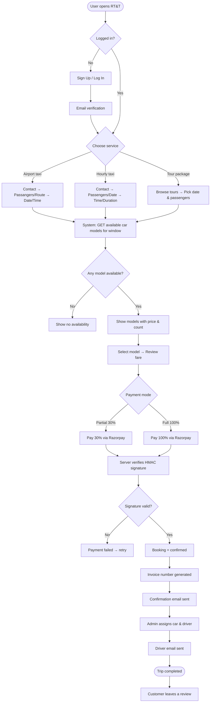
```mermaid
flowchart TD
    A([User opens RT&T]) --> B{Logged in?}
    B -- No --> C[Sign Up / Log In]
    C --> D[Email verification]
    D --> E{Choose service}
    B -- Yes --> E

    E -- Airport taxi --> F1[Contact → Passangers/Route → Date/Time]
    E -- Hourly taxi --> F2[Contact → Passengers/Date → Time/Duration]
    E -- Tour package --> F3[Browse tours → Pick date & passengers]

    F1 --> G[System: GET available car models for window]
    F2 --> G
    F3 --> G

    G --> H{Any model available?}
    H -- No --> I[Show no availability]
    H -- Yes --> J[Show models with price & count]
    J --> K[Select model → Review fare]
    K --> L{Payment mode}

    L -- Partial 30% --> M1[Pay 30% via Razorpay]
    L -- Full 100% --> M2[Pay 100% via Razorpay]
    M1 --> N[Server verifies HMAC signature]
    M2 --> N
    N --> O{Signature valid?}
    O -- No --> P[Payment failed → retry]
    O -- Yes --> Q[Booking = confirmed]
    Q --> R[Invoice number generated]
    R --> S[Confirmation email sent]
    S --> T[Admin assigns car & driver]
    T --> U[Driver email sent]
    U --> V([Trip completed])
    V --> W[Customer leaves a review]
```

---

## 3. Software Requirements Specification (SRS)

### 3.1 Functional Requirements

#### Authentication (FR-AUTH)

| ID | Requirement |
|----|-------------|
| FR-AUTH-1 | The system shall register users with email + password via Supabase Auth and send a verification email. |
| FR-AUTH-2 | The system shall reject login attempts for unverified email addresses. |
| FR-AUTH-3 | The system shall support Google OAuth signup and login via `supabase.auth.signInWithOAuth({ provider: 'google' })`. The OAuth callback is routed through `GET /auth/callback` → `/auth/verify` → `POST /api/auth/exchange-code` — the same pipeline as email verification. No email verification step is required; Google guarantees a verified email address. |
| FR-AUTH-4 | The system shall validate inputs using `lib/validation.ts`: email (≤ 254 chars, RFC 5322 simplified), password (6–128 chars), full name (2–100 chars, ≥ 2 words, `[a-zA-Z\s'-]`), phone (exactly 10 digits after stripping non-digits). |
| FR-AUTH-5 | The system shall let an authenticated user change their password at `/change`. |
| FR-AUTH-6 | The system shall complete email verification on any device by exchanging the code at `/auth/verify` → `POST /api/auth/exchange-code` and redirecting the user authenticated. |

#### Booking (FR-BOOK)

| ID | Requirement |
|----|-------------|
| FR-BOOK-1 | The system shall support three booking types: `airport`, `tour`, `hourly`. |
| FR-BOOK-2 | The system shall require an authenticated user before creating a booking. |
| FR-BOOK-3 | The system shall generate a unique `booking_id` (`BK` + timestamp suffix) for every booking. |
| FR-BOOK-4 | For airport bookings, the system shall capture source/destination (from `destinations`), date, time, and passenger count. |
| FR-BOOK-5 | For hourly bookings, the system shall capture duration (days + hours), start date/time, and passenger count. |
| FR-BOOK-6 | For tour bookings, the system shall capture the selected `tour_package_id`, date, and passenger count (≤ `max_passengers`). |
| FR-BOOK-7 | The system shall display only car **models** that have ≥ 1 available unit for the requested window (`GET /api/cars/available-models`). |
| FR-BOOK-8 | The system shall display the full fare breakdown before booking confirmation. |
| FR-BOOK-9 | When conflict control is ON, the system shall block creation of an assignment overlapping an existing one (`start < otherEnd AND end > otherStart`). |
| FR-BOOK-10 | The system shall create new bookings with `booking_status = 'pending'`. |
| FR-BOOK-11 | The system shall allow a customer to request cancellation only if the trip start is > 24 h away; admins may cancel any time. |
| FR-BOOK-12 | The system shall delete `pending` bookings older than 24 h via the daily `cleanup-pending` cron. |

#### Payment (FR-PAY)

| ID | Requirement |
|----|-------------|
| FR-PAY-1 | The system shall offer `partial` (30% online) and `full` (100% online) payment modes. |
| FR-PAY-2 | The system shall compute the advance as `round(total × 0.30 × 100) / 100` and the cash portion as `total − advance`. |
| FR-PAY-3 | The system shall create a Razorpay order server-side (`POST /api/payment/create-order`) with amount in paise. |
| FR-PAY-4 | The system shall verify the Razorpay signature (`HMAC-SHA256(order_id + "|" + payment_id, RAZORPAY_KEY_SECRET)`) server-side (`POST /api/payment/verify`) before confirming the booking. |
| FR-PAY-5 | On verification success, the system shall: set `payments.txn_status = 'success'`; set `payments.payment_status` to `partial` or `paid`; set `bookings.booking_status = 'confirmed'`; write a `payment_records` row with an `invoice_number`; send a confirmation email. |
| FR-PAY-6 | The system shall let an admin mark the cash portion collected (`POST /api/payment/confirm-cash`), recording `cash_paid_at` and `cash_collected_by`. |
| FR-PAY-7 | The system shall track `payment_status ∈ {pending, partial, paid}` and `refund_status ∈ {none, pending, processed, failed}`. |
| FR-PAY-8 | The system shall expose a downloadable PDF invoice generated client-side. |

#### Admin (FR-ADM)

| ID | Requirement |
|----|-------------|
| FR-ADM-1 | The system shall authenticate admins with email + bcrypt-hashed password and issue a JWT valid for 24 h, stored in `localStorage` as `adminToken`. |
| FR-ADM-2 | The system shall protect all `/api/admin/*` (and admin-only) routes by verifying the JWT. |
| FR-ADM-3 | The system shall provide an Overview tab with totals (bookings, revenue, active, completed today, pending, cancelled) and recent bookings. |
| FR-ADM-4 | The system shall provide a Bookings tab to view/filter all bookings, open details, assign vehicle & driver, update status, confirm cash, and process cancellations. |
| FR-ADM-5 | The system shall provide Cars, Destinations, and Tours tabs with full CRUD (Tours includes image upload; Cars enforces a strict check when adding). |
| FR-ADM-6 | The system shall provide an Analytics tab: revenue, completed bookings, average booking value, fleet utilization %, status breakdown, fleet info, revenue breakdown (online vs cash), weekly booking trend, top destinations, top tours. |
| FR-ADM-7 | The system shall provide a Misc tab: dark mode toggle, app version/date, conflict control toggle + conflict scanner, pending-booking cleanup controls, profile edit, add-admin, and a link to this documentation. |
| FR-ADM-8 | The system shall allow an admin to create another admin (`POST /api/admin/create-admin`). |

#### Reviews (FR-REV)

| ID | Requirement |
|----|-------------|
| FR-REV-1 | The system shall allow authenticated users to submit a review (`reviewable_type ∈ {tour, taxi_booking}`, rating 1–5, optional title & comment). |
| FR-REV-2 | The system shall enforce one review per `(user_email, reviewable_type, reviewable_id)`. |
| FR-REV-3 | The system shall display reviews and aggregate stats (`avg`, `count`, 5→1 distribution) on tour pages. |
| FR-REV-4 | The system shall let admins toggle `is_visible` on a review. |

### 3.2 Non-Functional Requirements

| ID | Category | Requirement | Target / Note |
|----|----------|-------------|---------------|
| NFR-01 | Performance | First contentful paint on 4G mobile | < 3 s |
| NFR-02 | Performance | Serverless function execution | < 10 s (Vercel Hobby cap) |
| NFR-03 | Availability | Platform uptime | ≥ 99.5% (Vercel) |
| NFR-04 | Scalability | Concurrent users | ~100 |
| NFR-05 | Security | Secret keys never shipped to the client | Only `NEXT_PUBLIC_*` reach the browser |
| NFR-06 | Security | Payment card data never touches our servers | Razorpay-hosted checkout (PCI DSS) |
| NFR-07 | Security | HTTP hardening | `X-Frame-Options: SAMEORIGIN`, `X-Content-Type-Options: nosniff`, `Referrer-Policy: strict-origin-when-cross-origin`, `Permissions-Policy: camera=(), microphone=(), geolocation=()` |
| NFR-08 | Usability | Fully functional on screens ≥ 320 px wide | Mobile-first; admin dashboard responsive |
| NFR-09 | Maintainability | TypeScript across app & API; modular `lib/` | — |
| NFR-10 | SEO | Semantic HTML + Next.js Metadata API + dedicated landing pages | — |
| NFR-11 | Compatibility | Chrome, Safari, Firefox — last 2 major versions | No IE |
| NFR-12 | Data privacy | Personal data stored in Supabase (SOC 2) | — |

---

## 4. System Architecture Document (SAD)

### 4.1 Architecture Style

A **monolithic full-stack web application** on **Next.js 14 (App Router)**, deployed as static assets + serverless functions on **Vercel**, backed by **Supabase (PostgreSQL + Auth)**, with two external integrations: **Razorpay** (payments) and **Resend** (email). It is conceptually a **three-tier architecture**: presentation (React pages), application (API route handlers + `lib/`), data (Supabase).

### 4.2 System Architecture Diagram

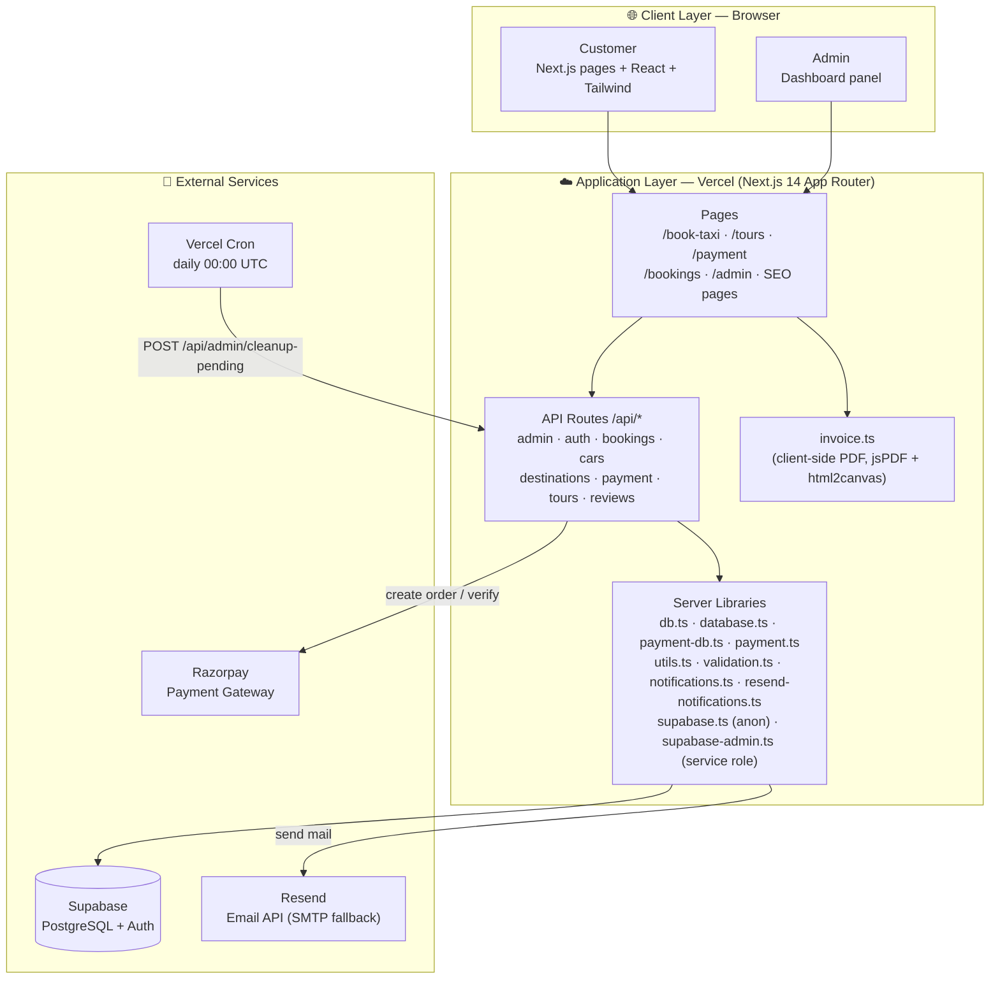
```mermaid
flowchart TB
    subgraph Client["🌐 Client Layer — Browser"]
        Cust["Customer<br/>Next.js pages + React + Tailwind"]
        Adm["Admin<br/>Dashboard panel"]
    end

    subgraph Vercel["☁️ Application Layer — Vercel (Next.js 14 App Router)"]
        Pages["Pages<br/>/book-taxi · /tours · /payment<br/>/bookings · /admin · SEO pages"]
        API["API Routes /api/*<br/>admin · auth · bookings · cars<br/>destinations · payment · tours · reviews"]
        Lib["Server Libraries<br/>db.ts · database.ts · payment-db.ts · payment.ts<br/>utils.ts · validation.ts · notifications.ts · resend-notifications.ts<br/>supabase.ts (anon) · supabase-admin.ts (service role)"]
        InvoiceLib["invoice.ts<br/>(client-side PDF, jsPDF + html2canvas)"]
    end

    subgraph External["🔌 External Services"]
        DB[("Supabase<br/>PostgreSQL + Auth")]
        RZP["Razorpay<br/>Payment Gateway"]
        Resend["Resend<br/>Email API (SMTP fallback)"]
        Cron["Vercel Cron<br/>daily 00:00 UTC"]
    end

    Cust --> Pages
    Adm --> Pages
    Pages --> API
    Pages --> InvoiceLib
    API --> Lib
    Lib --> DB
    API -- create order / verify --> RZP
    Lib -- send mail --> Resend
    Cron -- POST /api/admin/cleanup-pending --> API
```

### 4.3 Technology Stack

| Layer | Technology | Version | Purpose |
|-------|-----------|---------|---------|
| Framework | Next.js (App Router) | 14.x | Full-stack React + serverless API |
| Language | TypeScript (A JavaScript Superset) | 5.x | Type safety |
| UI | React | 18.x | Components |
| Styling | Tailwind CSS | 3.3.x | Utility-first CSS |
| DB & Auth | Supabase | `@supabase/supabase-js` 2.38.x, `auth-helpers-nextjs` 0.7.x | PostgreSQL + email/OAuth auth |
| Admin auth | bcryptjs 3.x + jsonwebtoken 9.x | — | Password hashing + 24 h JWT |
| Payments | Razorpay | 2.9.x | Online payment gateway |
| Email | Resend 2.1.x; Nodemailer 6.9.x | — | Transactional email + SMTP fallback |
| Animation | GSAP 3.15.x; `@lottiefiles/dotlottie-react` 0.19.x | — | Page/loader animations |
| PDF | jsPDF 2.5.x + html2canvas 1.4.x | — | Client-side invoices |
| State | Zustand 4.4.x | — | Lightweight global state |
| Toasts | react-hot-toast 2.4.x | — | In-app notifications |
| Icons | lucide-react 0.292.x | — | Icon set |
| Dates | date-fns 2.30.x | — | Formatting & math |
| HTTP | axios 1.6.x | — | HTTP requests |
| Docs viewer | react-markdown 9.x + remark-gfm 4.x + mermaid 11.x | — | In-app rendering of this document |
| Hosting | Vercel | — | CDN + serverless + cron |

### 4.4 Security Architecture

| Concern | Implementation |
|---------|----------------|
| Customer auth | Supabase session (managed cookies) via `@supabase/auth-helpers-nextjs` |
| Admin auth | `admins.password_hash` (bcrypt) → `jwt.sign({id,email,role}, JWT_SECRET, {expiresIn:'24h'})` → `localStorage.adminToken` |
| Admin route guard | Each `/api/admin/*` handler calls `jwt.verify(token, JWT_SECRET)` before any work; admin pages wrapped in `ProtectedAdminPage` |
| Secret handling | `SUPABASE_SERVICE_ROLE_KEY`, `RAZORPAY_KEY_SECRET`, `JWT_SECRET`, `RESEND_API_KEY` are server-only env vars; only `NEXT_PUBLIC_*` reach the browser (`next.config.js` `env` block) |
| Payment integrity | Razorpay hosted checkout; server verifies `HMAC-SHA256(order_id\|payment_id, secret)` against the returned signature |
| RLS | Customer-facing reads use the anon-key client (`lib/supabase.ts`) under Row Level Security; privileged writes use the service-role client (`lib/supabase-admin.ts`) which bypasses RLS — used **server-side only** |
| HTTP headers | Set globally in `next.config.js` (see NFR-07) |
| Input validation | `lib/validation.ts` on every user-supplied string |

### 4.5 Deployment Architecture

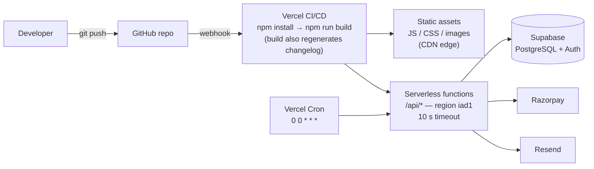
```mermaid
flowchart LR
    Dev["Developer"] -- git push --> GH["GitHub repo"]
    GH -- webhook --> VC["Vercel CI/CD<br/>npm install → npm run build<br/>(build also regenerates changelog)"]
    VC --> Static["Static assets<br/>JS / CSS / images<br/>(CDN edge)"]
    VC --> Fns["Serverless functions<br/>/api/* — region iad1<br/>10 s timeout"]
    Fns --> DB[("Supabase<br/>PostgreSQL + Auth")]
    Fns --> RZP["Razorpay"]
    Fns --> Resend["Resend"]
    CronSvc["Vercel Cron<br/>0 0 * * *"] --> Fns
```

---

## 5. High-Level Design (HLD)

### 5.1 System Modules

| Module | Responsibility | Key files |
|--------|---------------|-----------|
| User Auth | Signup, login, verification, OAuth, password change | `context/AuthContext.tsx`, `app/api/auth/*`, `app/login`, `app/signup`, `app/change`, `app/auth/verify` |
| Admin Auth | Admin login, JWT session, profile, add-admin | `context/AdminContext.tsx`, `components/ProtectedAdminPage.tsx`, `app/api/admin/login`, `/logout`, `/verify-session`, `/create-admin`, `/update-profile`, `scripts/generate-admin-hash.js` |
| Booking Engine | Create/read/update bookings; multi-step booking UI | `app/book-taxi`, `app/tours/[id]/book`, `app/api/bookings/*`, `lib/db.ts`, `lib/database.ts` |
| Vehicle Availability | Compute available car **models** for a window | `app/api/cars/available-models` |
| Vehicle Assignment | Admin assigns a specific car + driver to a booking | `app/api/bookings/assign-vehicle`, `/update-assignment`, `/get-assignments`, `/user-assignments` |
| Payment Processor | Razorpay orders & verification; cash collection; refunds | `app/api/payment/*`, `lib/payment.ts`, `lib/payment-db.ts`, `lib/payment-utils.ts` |
| Tour Management | Tour package CRUD + images + availability | `app/api/tours/*`, `lib/db.ts`, `lib/database.ts` |
| Destination & Pricing | Destination CRUD; pricing rules; hourly rates | `app/api/destinations/*`, `lib/database.ts` |
| Notification Service | Confirmation / driver / cancellation emails | `lib/notifications.ts`, `lib/resend-notifications.ts` |
| Invoice Generator | Client-side PDF invoice | `lib/invoice.ts` |
| Review System | Submit & display ratings | `app/api/reviews/*`, `lib/reviews.ts`, `components/ReviewForm.tsx`, `components/ReviewCard.tsx` |
| Admin Dashboard | One-stop operations UI (7 tabs) | `app/admin/page.tsx` |
| Conflict Control | Toggle-gated double-booking prevention + scanner | `app/api/admin/settings`, `app/api/admin/conflicts`, `app_settings` table |
| Cleanup Cron | Delete stale `pending` bookings daily | `app/api/admin/cleanup-pending`, `vercel.json` |
| SEO Pages | Local-search landing pages | `app/hollongi-airport-taxi`, `/donyi-polo-airport-taxi`, `/itanagar-airport-taxi`, `/hourly-taxi-itanagar`, `/arunachal-tours`, `/itanagar-tours` |

### 5.2 Module Interaction Diagram

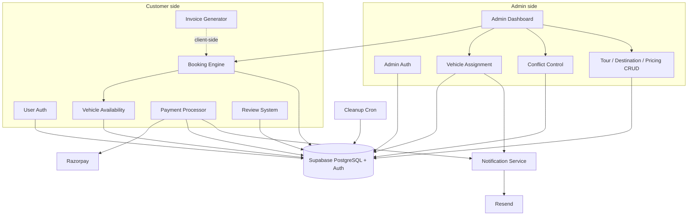
```mermaid
flowchart TB
    subgraph Customer["Customer side"]
        UAuth["User Auth"]
        Booking["Booking Engine"]
        Avail["Vehicle Availability"]
        Payment["Payment Processor"]
        Invoice["Invoice Generator"]
        Reviews["Review System"]
    end

    subgraph Admin["Admin side"]
        AAuth["Admin Auth"]
        Dash["Admin Dashboard"]
        Assign["Vehicle Assignment"]
        Conflict["Conflict Control"]
        Content["Tour / Destination / Pricing CRUD"]
    end

    Notif["Notification Service"]
    DB[("Supabase PostgreSQL + Auth")]
    RZP["Razorpay"]
    Resend["Resend"]
    CronJob["Cleanup Cron"]

    UAuth --> DB
    Booking --> Avail
    Booking --> DB
    Avail --> DB
    Payment --> RZP
    Payment --> DB
    Payment --> Notif
    Reviews --> DB
    Invoice -. client-side .-> Booking

    AAuth --> DB
    Dash --> Booking
    Dash --> Assign
    Dash --> Conflict
    Dash --> Content
    Assign --> DB
    Assign --> Notif
    Conflict --> DB
    Content --> DB
    Notif --> Resend
    CronJob --> DB
```

---

## 6. Low-Level Design (LLD)

### 6.1 Authentication Flows

**Customer signup (email + password)**
```
Client → supabase.auth.signUp({ email, password, options: { data: { full_name }, emailRedirectTo: origin/auth/callback } })
        → Supabase emails a verification link
User clicks link → GET /auth/callback?code=<code>
        → server redirects to /auth/verify?code=<code>&redirect=/bookings
        → /auth/verify calls POST /api/auth/exchange-code { code }
        → server: supabase.auth.exchangeCodeForSession(code)  → session tokens returned
        → client sets session cookies; redirect to /bookings (authenticated)
```

**Customer login (email + password)**
```
supabase.auth.signInWithPassword({ email, password })
   ↳ blocked by Supabase if email not yet verified → "verify your email" nudge shown with resend option
   ↳ session persisted; AuthContext exposes { user, isLoading, signOut, ... }
```

**Customer signup or login (Google OAuth)**
```
User clicks "Continue with Google" on /login or /signup
   → signInWithOAuth('google', redirect) in AuthContext
   → supabase.auth.signInWithOAuth({ provider: 'google', options: { redirectTo: origin/auth/callback?redirect=<redirect> } })
   → Browser redirected to Google consent screen
   → Google redirects back to GET /auth/callback?code=<code>&redirect=<redirect>
   → server redirects to /auth/verify?code=<code>&redirect=<redirect>
   → /auth/verify calls POST /api/auth/exchange-code { code }
   → server: supabase.auth.exchangeCodeForSession(code)  → session tokens returned
   → client sets session cookies; redirect to <redirect> (defaults to /bookings)

Note: no email verification step — Google guarantees a verified email.
      /auth/callback → /auth/verify → POST /api/auth/exchange-code is the
      shared pipeline for both email verification and Google OAuth.
```

**Admin login & guard**
```
POST /api/admin/login { email, password }
   SELECT * FROM admins WHERE email = ? AND is_active = true
   bcrypt.compare(password, row.password_hash)  → must be true
   token = jwt.sign({ id, email, role }, JWT_SECRET, { expiresIn: '24h' })
   UPDATE admins SET last_login = now() WHERE id = row.id
   → { token, admin: { email, fullName, role } }
Client: localStorage.setItem('adminToken', token); AdminContext holds state

Every protected request: header  Authorization: Bearer <token>
   jwt.verify(token, JWT_SECRET) → { id, email, role }  (else 401)
```

### 6.2 Booking Creation

```
POST /api/bookings/create
Input (varies by type):
  booking_type ∈ { 'airport', 'tour', 'hourly' }
  user_name, user_email, phone, passenger_count
  start_datetime, end_datetime
  destination_id?      (airport)
  tour_package_id?     (tour)
  no_of_hours?         (hourly)
  car_model, amount_total

Steps:
  1. booking_id = generateBookingId()                    // "BK" + timestamp suffix
  2. read conflict_control_enabled from app_settings
  3. if enabled: check overlap against vehicle_assignments / committed bookings
        overlap ⇔ existing.start < new.end AND existing.end > new.start
        → if overlap, 409 Conflict
  4. INSERT INTO bookings (... , booking_status = 'pending')
  5. → { success: true, booking_id }
```

The booking UI is a guided multi-step wizard. There are two wizard implementations:

**Taxi wizard** (`app/book-taxi/page.tsx`) — covers Airport and Hourly types:
- **Airport** steps: `contact → destination/passengers → date/time → car → confirm`
- **Hourly** steps: `contact → date/passengers → time/duration → car → confirm`

Each step component is memoised; refs preserve focus across re-renders; the `ContactStep` locks the email field when the user is already authenticated.

**Tour wizard** (`app/tours/[id]/book/page.tsx`) — dedicated per-package page:
- **Steps:** `contact → passengers → date → confirm`
- Authentication is enforced upfront: unauthenticated users are redirected to `/login?redirect=/tours/[id]/book` before the wizard renders.
- The email field is locked and pre-filled from the authenticated user's session; full name is pre-filled from `user_metadata.full_name` if available.
- Car model is **preset by the tour package** — the user does not choose a vehicle.
- Fare is `tour.price × passengers`; the confirm step offers full payment or **30% advance** (`Math.round(totalPrice × 0.3)`).
- On the date step, `GET /api/tours/[id]/availability?booking_date=` is called; if the tour's car model is fully booked for that date the user sees an advisory warning but can still proceed.
- On confirm, `booking_id` is generated client-side (`generateBookingId()`), the payload is sent to `POST /api/bookings/create` with `booking_type: 'tour'` and `tour_package_id`, the result is stored in `sessionStorage` as `tourBookingData`, and the user is redirected to `/payment?bookingId=...&type=tour&amount=<advancePayment>`.

### 6.3 Payment Processing

**Phase 1 — create order** (`POST /api/payment/create-order`)
```
Input: { amount, bookingId, currency: 'INR' }
  razorpay.orders.create({ amount: round(amount*100), currency: 'INR', receipt: bookingId })
  INSERT/UPSERT payments { booking_id, payment_type, amount_total,
                           amount_online_paid = amount, amount_cash_paid,
                           txn_status: 'pending', gateway: 'razorpay', payment_status: 'pending' }
  → { orderId }
```

**Phase 2 — browser checkout**
```
Razorpay modal opens with { key: NEXT_PUBLIC_RAZORPAY_KEY_ID, amount: round(amount*100),
                            currency: 'INR', name: "Rina's Tours and Travels", order_id: orderId }
On success Razorpay returns { razorpay_order_id, razorpay_payment_id, razorpay_signature }
```

**Phase 3 — verify & confirm** (`POST /api/payment/verify`)
```
Input: { orderId, paymentId, signature, bookingId, amount, paymentType, userEmail, userName, ... }
  expected = HMAC_SHA256(orderId + "|" + paymentId, RAZORPAY_KEY_SECRET)
  if expected !== signature → 400 "Invalid payment signature"
  UPDATE payments SET txn_status='success', txn_id=paymentId,
                      payment_status = (paymentType==='partial' ? 'partial' : 'paid')
  UPDATE bookings SET booking_status='confirmed'
  invoice_number = generateInvoiceNumber()
  INSERT payment_records { payment_id, booking_id, txn_type:'online', txn_id, gateway:'razorpay',
                           amount, currency:'INR', status:'success', razorpay_order_id, invoice_number }
  sendBookingConfirmation({ to: userEmail, ... })   // via Resend
  → { success: true, bookingId, invoiceNumber }
```

**Cash collection** (`POST /api/payment/confirm-cash`, admin) — sets `amount_cash_paid`, `cash_paid_at`, `cash_collected_by`; helper `markCashPaymentCollected()` in `lib/payment-db.ts`.

**Payment-amount math** (`lib/payment-utils.ts`, client-safe):
```ts
calculatePaymentAmounts(total, 'full')    // { amountOnlinePaid: total,        amountCashPaid: 0 }
calculatePaymentAmounts(total, 'partial') // online = round(total*0.3*100)/100; cash = round((total-online)*100)/100
validatePaymentAmounts('full',   total, online) // |online - total| < 0.01
validatePaymentAmounts('partial',total, online) // |online - round(total*0.3*100)/100| < 0.01
```

### 6.4 Vehicle Availability Algorithm

```
GET /api/cars/available-models?booking_date=YYYY-MM-DD&start_time=HH:MM&end_time=HH:MM

reqStart = combine(booking_date, start_time)
reqEnd   = combine(booking_date, end_time)

allCars       = SELECT * FROM cars WHERE is_active = true
occupiedCarIds = SELECT car_id FROM vehicle_assignments
                 WHERE start_datetime < reqEnd AND end_datetime > reqStart   -- overlap

availableCars = allCars where id ∉ occupiedCarIds
models        = group availableCars by model_name → for each:
                { model_name, class, capacity, per_km_charge, per_hr_charge,
                  available_count = count of free units of that model }
→ { models }
```

Users only ever see the **model-level** projection. The number plate, driver, and specific `car_id` are revealed only after an admin assigns a vehicle via `POST /api/bookings/assign-vehicle`.

### 6.5 Conflict Control System

- Stored as `app_settings.conflict_control_enabled` (text `'true'`/`'false'`, default `'true'`).
- **ON** — `POST /api/bookings/create` and `assign-vehicle` reject overlapping commitments.
- **OFF** — no automatic blocking; the admin manages conflicts manually. The Misc tab's **conflict scanner** (`GET /api/admin/conflicts`) reports two classes:
  - **Assignment conflicts** — the *same specific car* committed to overlapping windows.
  - **Model conflicts** — more bookings of a model than there are units of that model in an overlapping window (over-subscription), which can arise in tour flows.
- Toggle via `POST /api/admin/settings { key:'conflict_control_enabled', value:'true'|'false' }`. Turning it OFF shows a warning modal first.

### 6.6 Invoice Generation

`lib/invoice.ts` builds a PDF entirely client-side (jsPDF, with html2canvas for any rendered fragments):

```
InvoiceData {
  invoiceNumber, bookingId,
  customerName, customerEmail, customerPhone,
  serviceType,                      // "Airport Taxi" | "Tour Package" | "Hourly Taxi"
  bookingDate, pickupTime,
  vehicleModel, passengers,
  amountTotal, amountOnlinePaid, amountCashDue,
  paymentType                       // 'partial' | 'full'
}
```
Layout: company header ("Rina's Tours and Travels") · invoice meta (number, date, booking ID) · customer block · service block · payment-breakdown table (online paid / cash due / total) · footer/terms. Triggered from the Booking Confirmed page and from My Bookings.

### 6.7 Stale-Booking Cleanup

`POST /api/admin/cleanup-pending` (called by Vercel Cron `0 0 * * *`) deletes bookings where `booking_status = 'pending'` and `created_at < now() − 24h`. The cleanup window is configurable from the Misc tab (1–30 days) and the auto-cleanup can be toggled off; a manual "run now" button is also provided.

---

## 7. Technical Design Document (TDD)

### 7.1 Frontend Architecture

**State strategy**

| State | Mechanism | Examples |
|-------|-----------|----------|
| Customer auth | `AuthContext` (Supabase session) | `user`, `isLoading`, `signInWithEmail`, `signUpWithEmail`, `signInWithOAuth`, `resendVerificationEmail`, `signOut` |
| Admin session | `AdminContext` (JWT in `localStorage`) | `isAdmin`, `adminEmail`, `adminFullName`, `isLoading`, `login`, `logout`, `updateAdminProfile` |
| Cross-page handoff | `sessionStorage` | `bookingData` / `tourBookingData` passed from booking flow to `/payment` |
| Global UI | Zustand | misc shared UI flags |
| Local | `useState` / `useRef` | wizard step, form fields, modals; refs keep focus across re-renders |

**Page-render strategy**

| Page(s) | Strategy | Reason |
|---------|----------|--------|
| `/` | CSR | Heavy GSAP/Lottie animation, interactive |
| `/book-taxi`, `/tours/[id]/book`, `/payment`, `/bookings`, `/booking-confirmed` | CSR | Dynamic, auth-dependent, talk to Supabase client |
| `/tours`, `/tours/[id]/reviews` | CSR | Live data + reviews |
| `/admin`, `/admin/docs` | CSR | Protected, real-time, no SEO need |
| SEO pages (`*-airport-taxi`, `*-tours`) | Static content | Optimised for organic search |

**Root layout** (`app/layout.tsx`): `AuthContext.Provider → AdminContext.Provider → AppSplashLoader → RouteScrollUnlocker → Header → {page} → Footer`. `SmoothScrollWrapper` wraps animated pages.

### 7.2 API Design Conventions

- Handlers live in `app/api/**/route.ts` (App Router Route Handlers).
- Response envelope: `{ success: boolean, ...data }` or `{ success: false, error: string }`. Some read endpoints return a named collection (e.g. `{ bookings: [...] }`, `{ models: [...] }`).
- HTTP codes used per semantics: `200`, `201`, `400`, `401`, `403`, `404`, `409`, `500`.
- Admin routes verify `Authorization: Bearer <jwt>` first.
- Supabase client choice: anon (`lib/supabase.ts`) for customer reads under RLS; service-role (`lib/supabase-admin.ts`) for privileged server-side writes (the admin client is module-cached to survive Vercel warm starts).

### 7.3 Database Client Usage Matrix

| Operation | Client | Library |
|-----------|--------|---------|
| Customer reads own bookings | anon (RLS) | `lib/db.ts` (`fetchBookingsByEmail`, `fetchBookingById`) |
| Create / update bookings (server) | service role | `lib/db.ts` (`createBooking`, `updateBooking`, `updateBookingPaymentStatus`) |
| Payment writes | service role | `lib/payment-db.ts` (`createPaymentInDB`, `getPaymentByBookingId`, `updatePaymentStatus`, `createPaymentRecord`, `getPaymentRecordsByPaymentId`, `markCashPaymentCollected`) |
| Tours / destinations / pricing CRUD | service role | `lib/database.ts` |
| Tour fetch + rating stats (customer) | anon | `lib/db.ts` (`fetchAllTours`, `fetchTourById`, `fetchAllTourRatingStats`), `lib/reviews.ts` |
| Auth | Supabase Auth SDK | `lib/supabase.ts` |
| Admin auth (admins table) | service role | direct in `app/api/admin/login` |

### 7.4 Email Notification System

Primary: **Resend** (`lib/resend-notifications.ts`). Fallback: **SMTP via Nodemailer** (`lib/notifications.ts`).

| Trigger | Recipient | Content |
|---------|-----------|---------|
| Payment verified | Customer | Booking confirmation: booking ID, invoice number, trip details, payment breakdown |
| Vehicle assigned / reassigned | Driver | Assignment: booking details + customer name & phone |
| Cancellation processed | Customer | Cancellation confirmation + refund notes if any |

SMS / WhatsApp are placeholders only (currently console-logged).

### 7.5 Cron Jobs

| Job | Schedule (`vercel.json`) | Endpoint | Action |
|-----|--------------------------|----------|--------|
| Cleanup stale pending bookings | `0 0 * * *` (daily 00:00 UTC) | `POST /api/admin/cleanup-pending` | Delete `pending` bookings older than the configured window (default 24 h) |

### 7.6 Utility Functions

`lib/utils.ts`:
| Function | Signature | Notes |
|----------|-----------|-------|
| `formatCurrency` | `(amount: number, currency = 'INR') => string` | e.g. `₹1,500.00` |
| `formatDate` | `(date: string \| Date) => string` | e.g. `21 Apr 2026` |
| `formatDateTime` | `(date: string \| Date) => string` | date + time |
| `formatTime` | `(time: string) => string` | e.g. `10:30 AM` |
| `validateEmail` / `validatePhoneNumber` / `validateName` | `(v: string) => boolean` | quick boolean checks (stricter checks live in `lib/validation.ts`) |
| `calculateAdvancePayment` | `(total: number) => number` | 30% of total |
| `calculateRemainingPayment` | `(total: number) => number` | 70% of total |
| `calculateTotalPrice` | `(basePrice: number, hours?: number, days?: number) => number` | hourly/daily totals |
| `generateBookingId` | `() => string` | `BK` + timestamp suffix |
| `generateInvoiceNumber` | `() => string` | sequential-style invoice number |
| `canCancelBooking` | `(bookingDate: string) => boolean` | true if > 24 h before trip |
| `getBookingStatus` | `(status: string) => { label, color, icon }` | UI badge meta |
| `getPaymentStatusBadge` | `(status: string) => { label, color }` | UI badge meta |
| `truncateString` / `capitalizeFirstLetter` / `toTitleCase` | string helpers | — |
| `sleep` | `(ms: number) => Promise<void>` | — |
| `isDevelopment` / `isProduction` | `() => boolean` | env checks |

`lib/payment-utils.ts`: `calculatePaymentAmounts(total, type)`, `validatePaymentAmounts(type, total, online)` — see [§6.3](#63-payment-processing).

### 7.7 Validation Rules (`lib/validation.ts`)

| Validator | Rules | Returns |
|-----------|-------|---------|
| `validateEmail(email)` | non-empty, ≤ 254 chars, matches `^[^\s@]+@[^\s@]+\.[^\s@]+$` | `{ valid, error? }` |
| `validatePassword(password)` | 6–128 chars | `{ valid, error? }` |
| `validateFullName(name)` | 2–100 chars; only `[a-zA-Z\s'-]`; ≥ 2 words | `{ valid, error? }` |
| `validatePhoneNumber(phone)` | exactly 10 digits after stripping non-digits | `{ valid, error? }` |

### 7.8 Error Handling

- **Client:** `react-hot-toast` for user-facing errors/success; form validation runs before API calls; API errors surface the `error` field.
- **Server:** every handler wrapped in `try/catch`; known failures return precise messages with the right status; unknown failures return generic `500`. (Sentry/Rollbar is a planned addition.)

### 7.9 Performance Notes

- Next.js `<Image>` for all images (auto WebP, lazy-loading); `next.config.js` allows arbitrary remote hosts because tour images are external URLs.
- Tailwind purges unused classes in production.
- GSAP timelines are scoped to component lifecycle.
- Lottie JSON loaded async.
- `supabaseAdmin` is module-cached.
- SEO pages are lightweight static content for good Core Web Vitals.

---

## 8. Entity-Relationship Diagram (ERD)

> All 10 tables are defined in `sql/` (see `sql/README.md` for execution order). The ERD below reflects the exact columns present in those files.

**Diagram A — Core Transactions** (bookings, payments, vehicle assignments)

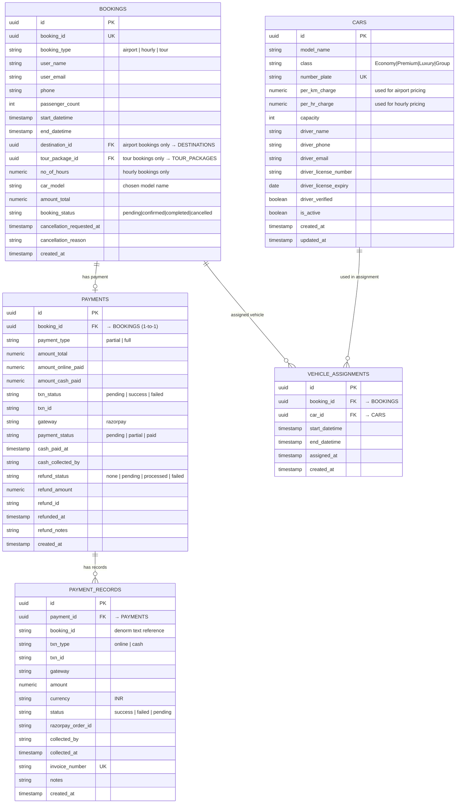
```mermaid
erDiagram
    BOOKINGS {
        uuid    id               PK
        uuid    booking_id       UK
        string  booking_type        "airport | hourly | tour"
        string  user_name
        string  user_email
        string  phone
        int     passenger_count
        timestamp start_datetime
        timestamp end_datetime
        uuid    destination_id   FK  "airport bookings only → DESTINATIONS"
        uuid    tour_package_id  FK  "tour bookings only → TOUR_PACKAGES"
        numeric no_of_hours         "hourly bookings only"
        string  car_model           "chosen model name"
        numeric amount_total
        string  booking_status      "pending|confirmed|completed|cancelled"
        timestamp cancellation_requested_at
        string  cancellation_reason
        timestamp created_at
    }
    PAYMENTS {
        uuid    id               PK
        uuid    booking_id       FK  "→ BOOKINGS (1-to-1)"
        string  payment_type        "partial | full"
        numeric amount_total
        numeric amount_online_paid
        numeric amount_cash_paid
        string  txn_status          "pending | success | failed"
        string  txn_id
        string  gateway             "razorpay"
        string  payment_status      "pending | partial | paid"
        timestamp cash_paid_at
        string  cash_collected_by
        string  refund_status       "none | pending | processed | failed"
        numeric refund_amount
        string  refund_id
        timestamp refunded_at
        string  refund_notes
        timestamp created_at
    }
    PAYMENT_RECORDS {
        uuid    id               PK
        uuid    payment_id       FK  "→ PAYMENTS"
        string  booking_id           "denorm text reference"
        string  txn_type            "online | cash"
        string  txn_id
        string  gateway
        numeric amount
        string  currency            "INR"
        string  status              "success | failed | pending"
        string  razorpay_order_id
        string  collected_by
        timestamp collected_at
        string  invoice_number   UK
        string  notes
        timestamp created_at
    }
    VEHICLE_ASSIGNMENTS {
        uuid    id               PK
        uuid    booking_id       FK  "→ BOOKINGS"
        uuid    car_id           FK  "→ CARS"
        timestamp start_datetime
        timestamp end_datetime
        timestamp assigned_at
        timestamp created_at
    }
    CARS {
        uuid    id               PK
        string  model_name
        string  class               "Economy|Premium|Luxury|Group"
        string  number_plate     UK
        numeric per_km_charge       "used for airport pricing"
        numeric per_hr_charge       "used for hourly pricing"
        int     capacity
        string  driver_name
        string  driver_phone
        string  driver_email
        string  driver_license_number
        date    driver_license_expiry
        boolean driver_verified
        boolean is_active
        timestamp created_at
        timestamp updated_at
    }

    BOOKINGS         ||--o|  PAYMENTS            : "has payment"
    PAYMENTS         ||--o{  PAYMENT_RECORDS     : "has records"
    BOOKINGS         ||--o{  VEHICLE_ASSIGNMENTS : "assigned vehicle"
    CARS             ||--o{  VEHICLE_ASSIGNMENTS : "used in assignment"
```

**Diagram B — Reference & Lookup Tables**

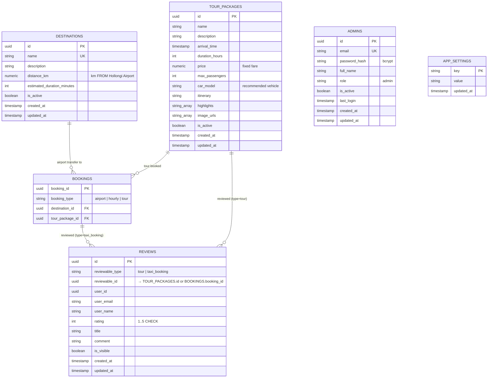
```mermaid
erDiagram
    BOOKINGS {
        uuid    booking_id  PK
        string  booking_type   "airport | hourly | tour"
        uuid    destination_id FK
        uuid    tour_package_id FK
    }
    DESTINATIONS {
        uuid    id               PK
        string  name             UK
        string  description
        numeric distance_km         "km FROM Hollongi Airport"
        int     estimated_duration_minutes
        boolean is_active
        timestamp created_at
        timestamp updated_at
    }
    TOUR_PACKAGES {
        uuid    id               PK
        string  name
        string  description
        timestamp arrival_time
        int     duration_hours
        numeric price               "fixed fare"
        int     max_passengers
        string  car_model           "recommended vehicle"
        string  itinerary
        string_array highlights
        string_array image_urls
        boolean is_active
        timestamp created_at
        timestamp updated_at
    }
    REVIEWS {
        uuid    id               PK
        string  reviewable_type     "tour | taxi_booking"
        uuid    reviewable_id       "→ TOUR_PACKAGES.id or BOOKINGS.booking_id"
        uuid    user_id
        string  user_email
        string  user_name
        int     rating              "1..5 CHECK"
        string  title
        string  comment
        boolean is_visible
        timestamp created_at
        timestamp updated_at
    }
    ADMINS {
        uuid    id               PK
        string  email            UK
        string  password_hash       "bcrypt"
        string  full_name
        string  role                "admin"
        boolean is_active
        timestamp last_login
        timestamp created_at
        timestamp updated_at
    }
    APP_SETTINGS {
        string  key              PK
        string  value
        timestamp updated_at
    }

    DESTINATIONS   ||--o{  BOOKINGS      : "airport transfer to"
    TOUR_PACKAGES  ||--o{  BOOKINGS      : "tour booked"
    TOUR_PACKAGES  ||--o{  REVIEWS       : "reviewed (type=tour)"
    BOOKINGS       ||--o{  REVIEWS       : "reviewed (type=taxi_booking)"
```

### 8.1 Relationships Summary

| From | To | Cardinality | Via | Notes |
|------|----|-------------|-----|-------|
| `bookings` | `payments` | 1 : 0..1 | `payments.booking_id` | one payment record per booking |
| `payments` | `payment_records` | 1 : N | `payment_records.payment_id` | one row per online/cash transaction |
| `bookings` | `payment_records` | 1 : N | `payment_records.booking_id` | denormalised text back-reference |
| `bookings` | `vehicle_assignments` | 1 : N | `vehicle_assignments.booking_id` | usually one; reassignment adds rows |
| `cars` | `vehicle_assignments` | 1 : N | `vehicle_assignments.car_id` | a car is used in many assignments over time |
| `destinations` | `bookings` | 1 : N | `bookings.destination_id` | **airport bookings only** — FROM Hollongi Airport TO this destination |
| `tour_packages` | `bookings` | 1 : N | `bookings.tour_package_id` | **tour bookings only** |
| `tour_packages` | `reviews` | 1 : N | polymorphic (`reviewable_type = 'tour'`) | |
| `bookings` | `reviews` | 1 : N | polymorphic (`reviewable_type = 'taxi_booking'`) | |
| `admins` | — | standalone | — | JWT-based admin auth, no FK to bookings |
| `app_settings` | — | standalone | — | key/value feature flags (e.g. `conflict_control_enabled`) |

---

## 9. Data Flow Diagrams (DFDs)

### 9.1 Level 0 — Context Diagram

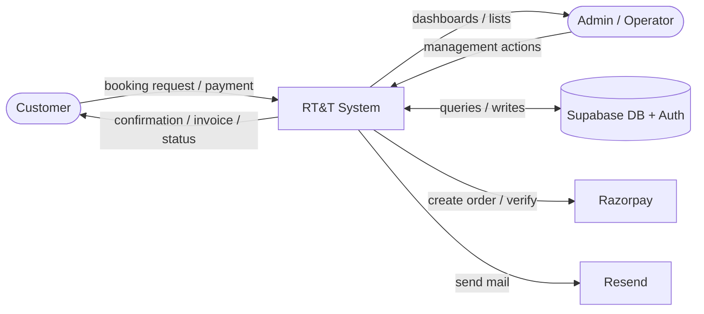
```mermaid
flowchart LR
    Customer(["Customer"]) -- booking request / payment --> Sys["RT&T System"]
    Sys -- confirmation / invoice / status --> Customer
    Admin(["Admin / Operator"]) -- management actions --> Sys
    Sys -- dashboards / lists --> Admin
    Sys <-- queries / writes --> DB[("Supabase DB + Auth")]
    Sys -- create order / verify --> RZP["Razorpay"]
    Sys -- send mail --> Email["Resend"]
```

### 9.2 Level 1 — Major Processes

**Customer Flow**

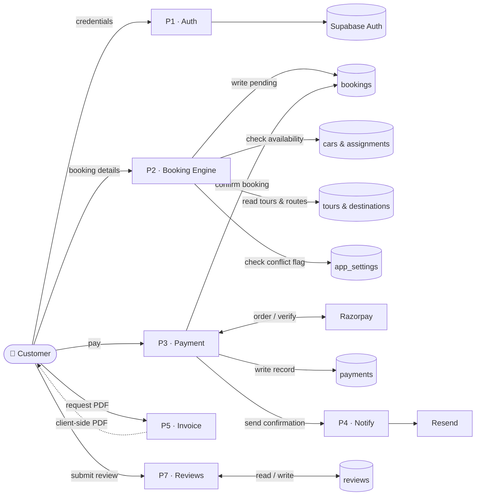
```mermaid
flowchart LR
    C(["👤 Customer"])

    C -->|credentials| P1["P1 · Auth"] --> SA[("Supabase Auth")]

    C -->|booking details| P2["P2 · Booking Engine"]
    P2 -->|write pending| D1[("bookings")]
    P2 -->|check availability| D3[("cars & assignments")]
    P2 -->|read tours & routes| D4[("tours & destinations")]
    P2 -->|check conflict flag| D6[("app_settings")]

    C -->|pay| P3["P3 · Payment"] <-->|order / verify| RZP["Razorpay"]
    P3 -->|confirm booking| D1
    P3 -->|write record| D2[("payments")]
    P3 -->|send confirmation| P4["P4 · Notify"] --> Resend["Resend"]

    C -->|request PDF| P5["P5 · Invoice"] -.->|client-side PDF| C
    C -->|submit review| P7["P7 · Reviews"] <-->|read / write| D5[("reviews")]
```

**Admin Flow**

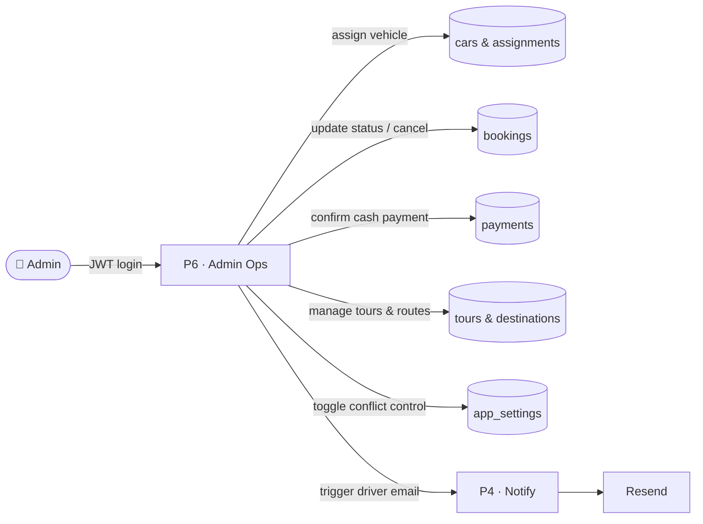
```mermaid
flowchart LR
    A(["🔧 Admin"])

    A -->|JWT login| P6["P6 · Admin Ops"]

    P6 -->|assign vehicle| D3[("cars & assignments")]
    P6 -->|update status / cancel| D1[("bookings")]
    P6 -->|confirm cash payment| D2[("payments")]
    P6 -->|manage tours & routes| D4[("tours & destinations")]
    P6 -->|toggle conflict control| D6[("app_settings")]
    P6 -->|trigger driver email| P4["P4 · Notify"] --> Resend["Resend"]
```

### 9.3 Level 2 — Payment Sub-Process

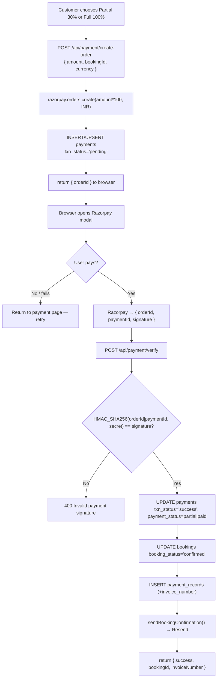
```mermaid
flowchart TD
    A[Customer chooses Partial 30% or Full 100%] --> B["POST /api/payment/create-order<br/>{ amount, bookingId, currency }"]
    B --> C["razorpay.orders.create(amount*100, INR)"]
    C --> D["INSERT/UPSERT payments<br/>txn_status='pending'"]
    D --> E["return { orderId } to browser"]
    E --> F[Browser opens Razorpay modal]
    F --> G{User pays?}
    G -- No / fails --> H[Return to payment page — retry]
    G -- Yes --> I["Razorpay → { orderId, paymentId, signature }"]
    I --> J["POST /api/payment/verify"]
    J --> K{"HMAC_SHA256(orderId|paymentId, secret) == signature?"}
    K -- No --> L[400 Invalid payment signature]
    K -- Yes --> M["UPDATE payments txn_status='success', payment_status=partial|paid"]
    M --> N["UPDATE bookings booking_status='confirmed'"]
    N --> O["INSERT payment_records (+invoice_number)"]
    O --> P["sendBookingConfirmation() → Resend"]
    P --> Q["return { success, bookingId, invoiceNumber }"]
```

---

## 10. UML Diagrams

### 10.1 Use Case Diagram

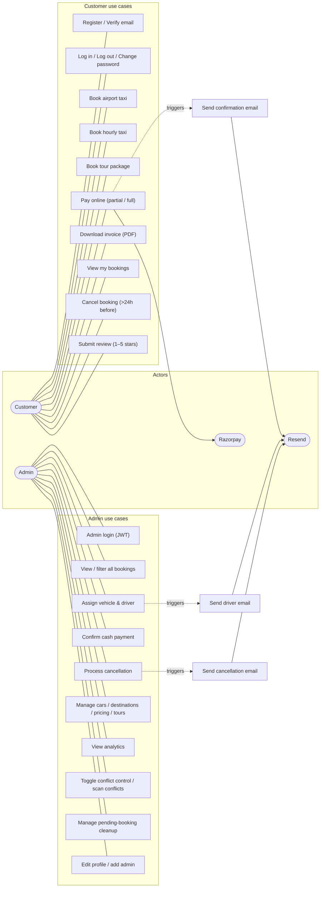
```mermaid
flowchart LR
    subgraph Actors
        C(["Customer"])
        A(["Admin"])
        R(["Razorpay"])
        E(["Resend"])
    end

    subgraph CustomerUC["Customer use cases"]
        UC1["Register / Verify email"]
        UC2["Log in / Log out / Change password"]
        UC3["Book airport taxi"]
        UC4["Book hourly taxi"]
        UC5["Book tour package"]
        UC6["Pay online (partial / full)"]
        UC7["Download invoice (PDF)"]
        UC8["View my bookings"]
        UC9["Cancel booking (>24h before)"]
        UC10["Submit review (1–5 stars)"]
    end

    subgraph AdminUC["Admin use cases"]
        UC11["Admin login (JWT)"]
        UC12["View / filter all bookings"]
        UC13["Assign vehicle & driver"]
        UC14["Confirm cash payment"]
        UC15["Process cancellation"]
        UC16["Manage cars / destinations / pricing / tours"]
        UC17["View analytics"]
        UC18["Toggle conflict control / scan conflicts"]
        UC19["Manage pending-booking cleanup"]
        UC20["Edit profile / add admin"]
    end

    C --- UC1 & UC2 & UC3 & UC4 & UC5 & UC6 & UC7 & UC8 & UC9 & UC10
    A --- UC11 & UC12 & UC13 & UC14 & UC15 & UC16 & UC17 & UC18 & UC19 & UC20
    UC6 --> R
    UC6 -. triggers .-> UC_E1["Send confirmation email"]
    UC13 -. triggers .-> UC_E2["Send driver email"]
    UC15 -. triggers .-> UC_E3["Send cancellation email"]
    UC_E1 & UC_E2 & UC_E3 --> E
```

### 10.2 Class Diagram (domain model)

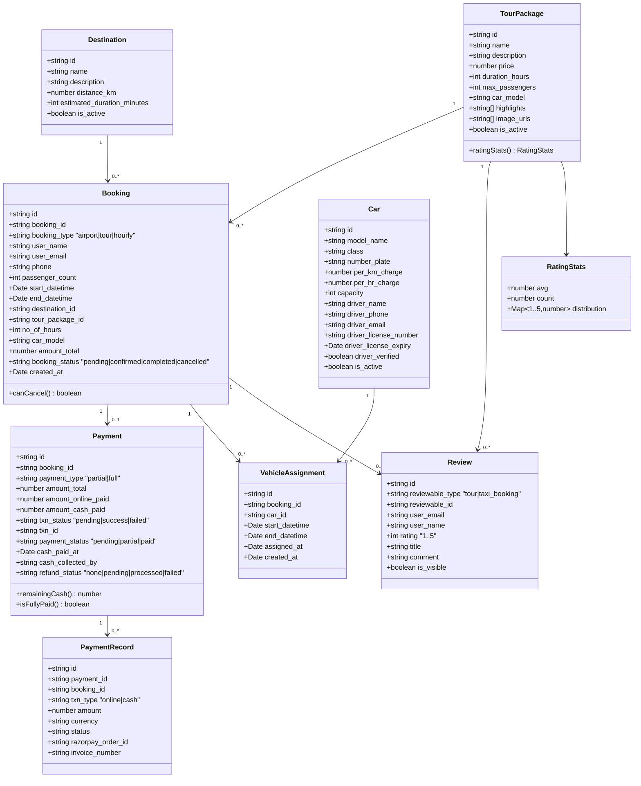
```mermaid
classDiagram
    class Booking {
        +string id
        +string booking_id
        +string booking_type  "airport|tour|hourly"
        +string user_name
        +string user_email
        +string phone
        +int passenger_count
        +Date start_datetime
        +Date end_datetime
        +string destination_id
        +string tour_package_id
        +int no_of_hours
        +string car_model
        +number amount_total
        +string booking_status  "pending|confirmed|completed|cancelled"
        +Date created_at
        +canCancel() boolean
    }
    class Payment {
        +string id
        +string booking_id
        +string payment_type  "partial|full"
        +number amount_total
        +number amount_online_paid
        +number amount_cash_paid
        +string txn_status  "pending|success|failed"
        +string txn_id
        +string payment_status  "pending|partial|paid"
        +Date cash_paid_at
        +string cash_collected_by
        +string refund_status  "none|pending|processed|failed"
        +remainingCash() number
        +isFullyPaid() boolean
    }
    class PaymentRecord {
        +string id
        +string payment_id
        +string booking_id
        +string txn_type  "online|cash"
        +number amount
        +string currency
        +string status
        +string razorpay_order_id
        +string invoice_number
    }
    class VehicleAssignment {
        +string id
        +string booking_id
        +string car_id
        +Date start_datetime
        +Date end_datetime
        +Date assigned_at
        +Date created_at
    }
    class Car {
        +string id
        +string model_name
        +string class
        +string number_plate
        +number per_km_charge
        +number per_hr_charge
        +int capacity
        +string driver_name
        +string driver_phone
        +string driver_email
        +string driver_license_number
        +Date driver_license_expiry
        +boolean driver_verified
        +boolean is_active
    }
    class TourPackage {
        +string id
        +string name
        +string description
        +number price
        +int duration_hours
        +int max_passengers
        +string car_model
        +string[] highlights
        +string[] image_urls
        +boolean is_active
        +ratingStats() RatingStats
    }
    class Destination {
        +string id
        +string name
        +string description
        +number distance_km
        +int estimated_duration_minutes
        +boolean is_active
    }
    class Review {
        +string id
        +string reviewable_type  "tour|taxi_booking"
        +string reviewable_id
        +string user_email
        +string user_name
        +int rating  "1..5"
        +string title
        +string comment
        +boolean is_visible
    }
    class RatingStats {
        +number avg
        +number count
        +Map~1..5,number~ distribution
    }

    Booking "1" --> "0..1" Payment
    Payment "1" --> "0..*" PaymentRecord
    Booking "1" --> "0..*" VehicleAssignment
    Car "1" --> "0..*" VehicleAssignment
    Destination "1" --> "0..*" Booking
    TourPackage "1" --> "0..*" Booking
    TourPackage "1" --> "0..*" Review
    Booking "1" --> "0..*" Review
    TourPackage --> RatingStats
```

### 10.3 Sequence — Customer Booking & Payment

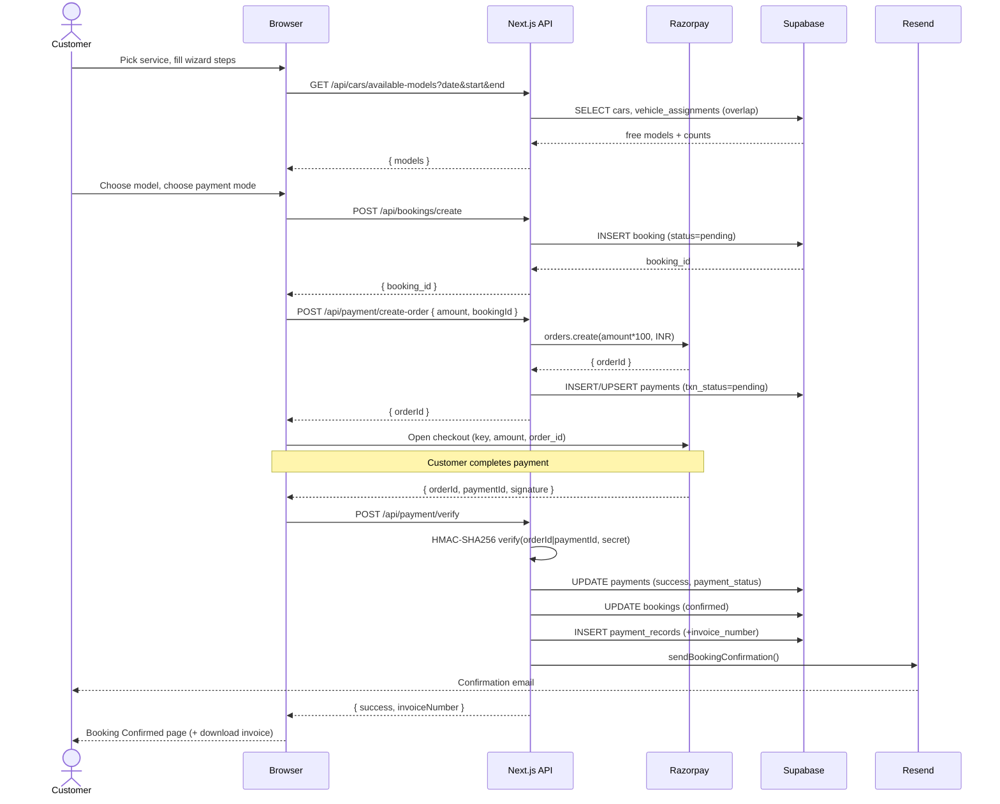
```mermaid
sequenceDiagram
    actor C as Customer
    participant B as Browser
    participant API as Next.js API
    participant RZP as Razorpay
    participant DB as Supabase
    participant M as Resend

    C->>B: Pick service, fill wizard steps
    B->>API: GET /api/cars/available-models?date&start&end
    API->>DB: SELECT cars, vehicle_assignments (overlap)
    DB-->>API: free models + counts
    API-->>B: { models }
    C->>B: Choose model, choose payment mode
    B->>API: POST /api/bookings/create
    API->>DB: INSERT booking (status=pending)
    DB-->>API: booking_id
    API-->>B: { booking_id }
    B->>API: POST /api/payment/create-order { amount, bookingId }
    API->>RZP: orders.create(amount*100, INR)
    RZP-->>API: { orderId }
    API->>DB: INSERT/UPSERT payments (txn_status=pending)
    API-->>B: { orderId }
    B->>RZP: Open checkout (key, amount, order_id)
    Note over B,RZP: Customer completes payment
    RZP-->>B: { orderId, paymentId, signature }
    B->>API: POST /api/payment/verify
    API->>API: HMAC-SHA256 verify(orderId|paymentId, secret)
    API->>DB: UPDATE payments (success, payment_status)
    API->>DB: UPDATE bookings (confirmed)
    API->>DB: INSERT payment_records (+invoice_number)
    API->>M: sendBookingConfirmation()
    M-->>C: Confirmation email
    API-->>B: { success, invoiceNumber }
    B-->>C: Booking Confirmed page (+ download invoice)
```

### 10.4 Sequence — Admin Login & Vehicle Assignment

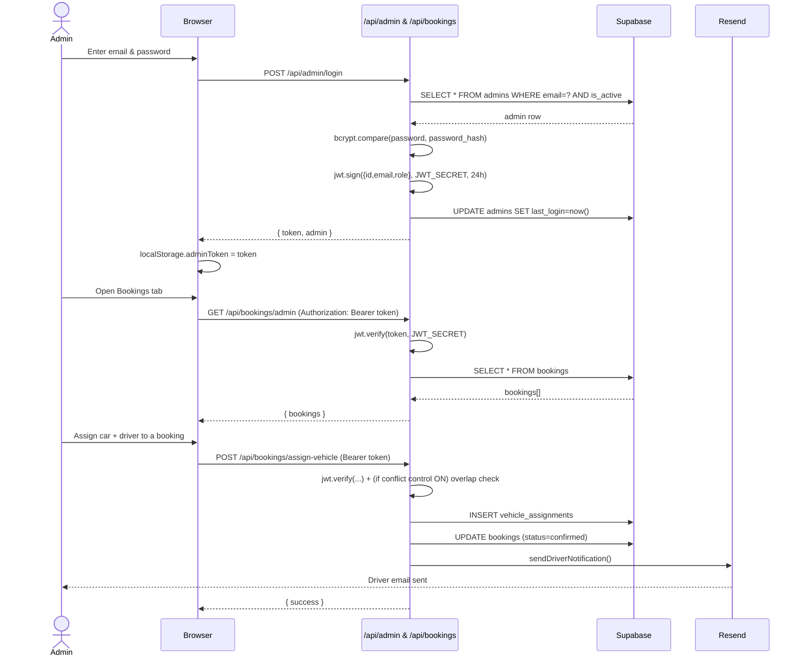
```mermaid
sequenceDiagram
    actor A as Admin
    participant B as Browser
    participant API as /api/admin & /api/bookings
    participant DB as Supabase
    participant M as Resend

    A->>B: Enter email & password
    B->>API: POST /api/admin/login
    API->>DB: SELECT * FROM admins WHERE email=? AND is_active
    DB-->>API: admin row
    API->>API: bcrypt.compare(password, password_hash)
    API->>API: jwt.sign({id,email,role}, JWT_SECRET, 24h)
    API->>DB: UPDATE admins SET last_login=now()
    API-->>B: { token, admin }
    B->>B: localStorage.adminToken = token

    A->>B: Open Bookings tab
    B->>API: GET /api/bookings/admin  (Authorization: Bearer token)
    API->>API: jwt.verify(token, JWT_SECRET)
    API->>DB: SELECT * FROM bookings
    DB-->>API: bookings[]
    API-->>B: { bookings }

    A->>B: Assign car + driver to a booking
    B->>API: POST /api/bookings/assign-vehicle (Bearer token)
    API->>API: jwt.verify(...)  + (if conflict control ON) overlap check
    API->>DB: INSERT vehicle_assignments
    API->>DB: UPDATE bookings (status=confirmed)
    API->>M: sendDriverNotification()
    M-->>A: Driver email sent
    API-->>B: { success }
```

### 10.5 State Machine — Booking Status

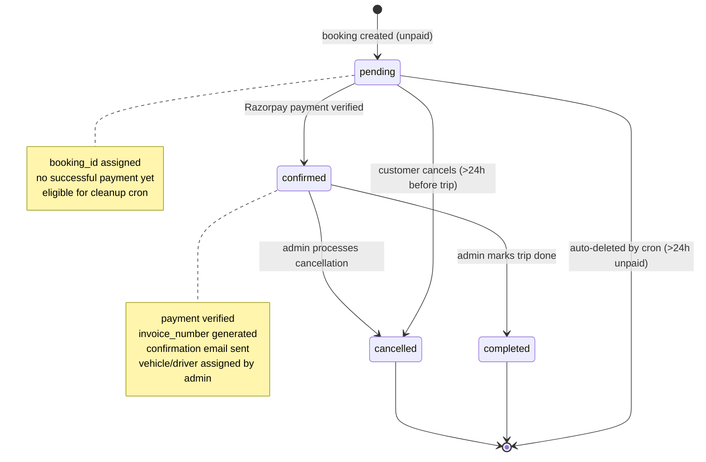
```mermaid
stateDiagram-v2
    [*] --> pending : booking created (unpaid)
    pending --> confirmed : Razorpay payment verified
    pending --> cancelled : customer cancels (>24h before trip)
    pending --> [*] : auto-deleted by cron (>24h unpaid)
    confirmed --> completed : admin marks trip done
    confirmed --> cancelled : admin processes cancellation
    completed --> [*]
    cancelled --> [*]

    note right of pending
        booking_id assigned
        no successful payment yet
        eligible for cleanup cron
    end note
    note right of confirmed
        payment verified
        invoice_number generated
        confirmation email sent
        vehicle/driver assigned by admin
    end note
```

### 10.6 State Machine — Payment Status

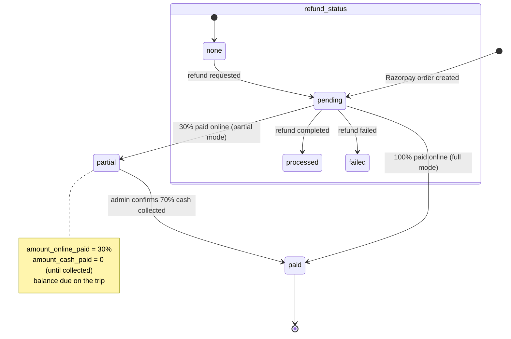
```mermaid
stateDiagram-v2
    [*] --> pending : Razorpay order created
    pending --> partial : 30% paid online (partial mode)
    pending --> paid : 100% paid online (full mode)
    partial --> paid : admin confirms 70% cash collected
    paid --> [*]

    state refund_status {
        [*] --> none
        none --> pending : refund requested
        pending --> processed : refund completed
        pending --> failed : refund failed
    }

    note right of partial
        amount_online_paid = 30%
        amount_cash_paid = 0 (until collected)
        balance due on the trip
    end note
```

### 10.7 Component Diagram

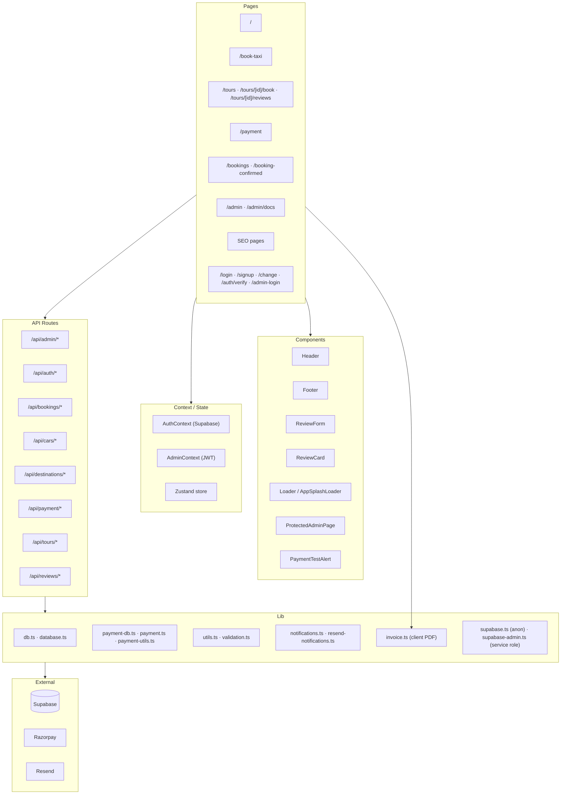
```mermaid
flowchart TB
    subgraph PagesLayer["Pages"]
        Home["/"]
        BookTaxi["/book-taxi"]
        Tours["/tours · /tours/[id]/book · /tours/[id]/reviews"]
        Payment["/payment"]
        Bookings["/bookings · /booking-confirmed"]
        AdminP["/admin · /admin/docs"]
        SEO["SEO pages"]
        AuthPages["/login · /signup · /change · /auth/verify · /admin-login"]
    end
    subgraph ComponentsLayer["Components"]
        Header
        Footer
        ReviewForm
        ReviewCard
        Loader["Loader / AppSplashLoader"]
        ProtectedAdminPage
        PaymentTestAlert
    end
    subgraph ContextLayer["Context / State"]
        AuthCtx["AuthContext (Supabase)"]
        AdminCtx["AdminContext (JWT)"]
        Z["Zustand store"]
    end
    subgraph APILayer["API Routes"]
        A1["/api/admin/*"]
        A2["/api/auth/*"]
        A3["/api/bookings/*"]
        A4["/api/cars/*"]
        A5["/api/destinations/*"]
        A6["/api/payment/*"]
        A7["/api/tours/*"]
        A8["/api/reviews/*"]
    end
    subgraph LibLayer["Lib"]
        L1["db.ts · database.ts"]
        L2["payment-db.ts · payment.ts · payment-utils.ts"]
        L3["utils.ts · validation.ts"]
        L4["notifications.ts · resend-notifications.ts"]
        L5["invoice.ts (client PDF)"]
        L6["supabase.ts (anon) · supabase-admin.ts (service role)"]
    end
    subgraph Ext["External"]
        SB[("Supabase")]
        RZP["Razorpay"]
        RS["Resend"]
    end

    PagesLayer --> ComponentsLayer
    PagesLayer --> ContextLayer
    PagesLayer --> APILayer
    PagesLayer --> L5
    APILayer --> LibLayer
    LibLayer --> Ext
```

---

## 11. Feature Reference

### 11.1 Airport Taxi Booking

- **Where:** `/book-taxi` (mode = airport).
- **Flow:** `contact → route → schedule → car → confirm`.
- **Direction:** always **FROM Hollongi Airport (Donyi Polo Airport)** TO a chosen destination. The source is fixed; customers pick their destination from the `destinations` list.
- **Inputs:** name, phone, email (locked if logged in); destination from `destinations` (carries `distance_km`, `estimated_duration_minutes`, `description`); date; time; passenger count.
- **Availability:** `GET /api/cars/available-models` with the computed `start`/`end`; only models with a free unit appear, each with `available_count`.
- **Pricing:** `destination.distance_km × car.per_km_charge`. No separate pricing table — the rate is stored on the `cars` row per car class. The confirm step shows the fare breakdown and payment split.
- **Constraints:** `passenger_count ≤ car.capacity`; conflict control (if ON) blocks overlapping commitments.
- **Output:** a `pending` booking → `/payment` (data passed via `sessionStorage.bookingData`).

### 11.2 Hourly Taxi Booking

- **Where:** `/book-taxi` (mode = hourly), and SEO entry `/hourly-taxi-itanagar`.
- **Flow:** `contact → details → schedule → car → confirm`.
- **Inputs:** name/phone/email; passenger count; date; start time; duration as **days + hours** (helper `formatDuration` renders e.g. `1d 4h`).
- **Pricing:** `no_of_hours × car.per_hr_charge`. Rate is stored on the `cars` row — no separate hourly-rates table.
- **Availability:** same overlap check over the full `[start, start+duration]` window.
- **Output:** `pending` booking → `/payment`.

### 11.3 Tour Package Booking

- **Where:** `/tours` (catalogue), `/tours/[id]/book`, `/tours/[id]/reviews`; category landings `/arunachal-tours`, `/itanagar-tours`.
- **Tour detail page:** name, description, `arrival_time`, `duration_hours`, `price`, `max_passengers`, `car_model`, `itinerary`, `highlights[]`, `image_url` + `image_urls[]` gallery, average rating & reviews (`fetchAllTourRatingStats`, `lib/reviews.ts`).
- **Booking:** select date & passengers (≤ `max_passengers`); availability is checked (tour vehicles are linked into the same conflict system); price is the fixed tour `price`.
- **Output:** `pending` booking with `tour_package_id` set → `/payment` (data via `sessionStorage.tourBookingData`, `type=tour`).

### 11.4 Payment System

- **Modes:** `partial` (30% online + 70% cash) and `full` (100% online).
- **Math:** advance `= round(total × 0.30 × 100)/100`; cash `= total − advance` (see `lib/payment-utils.ts`).
- **Gateway:** Razorpay hosted checkout; merchant name shown as **"Rina's Tours and Travels"**; amount in paise.
- **Server flow:** `POST /api/payment/create-order` → Razorpay order + `payments` row (`txn_status='pending'`); `POST /api/payment/verify` → HMAC check → `payments` (`success` + `payment_status`), `bookings` (`confirmed`), `payment_records` (+`invoice_number`), confirmation email.
- **Cash reconciliation:** admin → `POST /api/payment/confirm-cash` → sets `amount_cash_paid`, `cash_paid_at`, `cash_collected_by`.
- **Statuses:** `payments.payment_status ∈ {pending, partial, paid}`; `txn_status ∈ {pending, success, failed}`; `refund_status ∈ {none, pending, processed, failed}` (refunds are processed manually by an admin).
- **Helper library:** `lib/payment-db.ts` — `calculatePaymentAmounts`, `createPaymentInDB`, `getPaymentByBookingId`, `updatePaymentStatus`, `createPaymentRecord`, `getPaymentRecordsByPaymentId`, `markCashPaymentCollected`.
- **Test mode:** Razorpay test card `4111 1111 1111 1111` (any future expiry, any CVV); UPI `success@razorpay` / `failure@razorpay`.

### 11.5 Invoice System

- Client-side PDF (`lib/invoice.ts`, jsPDF + html2canvas) — no server round-trip.
- Contents: company header, invoice number, date, booking ID, customer block, service block, payment breakdown (online paid / cash due / total), footer.
- Available from Booking Confirmed and My Bookings; the invoice number originates from `payment_records.invoice_number` written at verification time.

### 11.6 Review System

- **Eligibility:** authenticated users; one review per `(user_email, reviewable_type, reviewable_id)` — DB unique index.
- **Data:** `reviewable_type ∈ {tour, taxi_booking}`, `rating` 1–5 (DB `CHECK`), optional `title`/`comment`, `is_visible` flag.
- **Display:** `components/ReviewCard.tsx` on tour pages; `components/ReviewForm.tsx` for submission; aggregate stats `{ avg, count, distribution{5..1} }` via `lib/reviews.ts` / `fetchAllTourRatingStats`.
- **Moderation:** admins toggle `is_visible`.
- **API:** `GET /api/reviews?reviewable_type=&reviewable_id=`, `POST /api/reviews`.

### 11.7 Email Notifications

- **Provider:** Resend (`lib/resend-notifications.ts`); SMTP via Nodemailer as fallback (`lib/notifications.ts`).
- **Events:** booking confirmation (on payment verify) → customer; vehicle assignment / reassignment → driver; cancellation processed → customer.
- **Note:** SMS & WhatsApp are placeholders (console-logged) — see TODOs.

### 11.8 Conflict Control System

- **Toggle:** `app_settings.conflict_control_enabled` (default ON).
- **ON:** booking creation and vehicle assignment reject overlaps (`existing.start < new.end AND existing.end > new.start`).
- **OFF:** manual management; the Misc-tab scanner (`GET /api/admin/conflicts`) lists **assignment conflicts** (same car, overlapping windows) and **model conflicts** (model over-subscribed in a window).
- **UX:** turning the toggle OFF shows a confirmation warning first.

### 11.9 SEO & Marketing Pages

| Route | Targets search intent |
|-------|-----------------------|
| `/hollongi-airport-taxi` | "Hollongi airport taxi" |
| `/donyi-polo-airport-taxi` | "Donyi Polo airport taxi" |
| `/itanagar-airport-taxi` | "Itanagar airport taxi" (legacy `/airport-taxi-itanagar` → 301 here) |
| `/hourly-taxi-itanagar` | "hourly taxi Itanagar" |
| `/arunachal-tours` | "Arunachal Pradesh tours" |
| `/itanagar-tours` | "Itanagar tours" |
| `/faq`, `/terms`, `/privacy` | informational / trust pages |

All use semantic HTML and the Next.js Metadata API; tour images may be arbitrary external URLs (allowed in `next.config.js`).

---

## 12. Admin Dashboard Reference

`app/admin/page.tsx` — wrapped in `ProtectedAdminPage`; tab state in `activeTab`; dark mode in `darkMode` (`localStorage.adminDarkMode`), applied via `data-admin-theme`. Tabs: **overview, bookings, car-management, destinations, tours, analytics, misc**. The Bookings tab badge shows the count of pending cancellations.

### 12.1 Overview Tab (`renderOverview`)
Stat cards: **Total Bookings**, **Total Revenue** (`Rs. {total}`), **Active Bookings**, **Completed Today**, **Pending Bookings** (filtered), **Cancelled Bookings** (filtered). Below: **Recent Bookings** list — each row links to a detail modal; desktop shows a 6-column grid (Booking ID, Customer, Type, Start Date, Amount, Status), mobile a stacked card.

### 12.2 Bookings Tab (`renderBookings`)
Full booking list with filters and the pending-cancellation badge. Per-booking actions: open details; **assign vehicle & driver** (`/api/bookings/assign-vehicle`, `/update-assignment`, `/get-assignments`); **update status** (`/api/bookings/update-status`); **confirm cash** (`/api/payment/confirm-cash`); **process cancellation** (`/api/admin/process-cancellation`). Hard-delete of a booking is also supported. Statuses revert to `confirmed` after a marked state is undone where applicable.

### 12.3 Cars Tab (`renderCarManagement`)
CRUD over `cars` (`GET/POST /api/cars`, `GET/PUT/DELETE /api/cars/[id]`): `model_name`, `class`, `capacity`, `number_plate`, `per_km_charge`, `per_hr_charge`, `is_active`. Adding a car runs a strict validation check (e.g. plate uniqueness, sane numbers). Active/inactive toggle controls availability listings.

### 12.4 Destinations Tab (`renderDestinations`)
CRUD over `destinations` (`GET/POST /api/destinations`, `GET/PUT/DELETE /api/destinations/[id]`): `name`, `distance_km`, `estimated_duration_minutes`, `description`, `is_active`. Distances are measured FROM Hollongi Airport. Distance and duration feed airport-fare calculation and ETAs shown to customers.

### 12.5 Tours Tab (`renderTours`)
CRUD over `tour_packages` (`GET/POST /api/tours`, `GET/PUT /api/tours/[id]`, `POST /api/tours/[id]/availability`, `POST /api/tours/upload-image`): `name`, `description`, `arrival_time`, `duration_hours`, `price`, `max_passengers`, `car_model`, `itinerary`, `highlights[]`, `image_url`, `image_urls[]` (multi-image), `is_active`. Tour vehicles are linked into the conflict system.

### 12.6 Analytics Tab (`renderAnalytics`)
- **Key metrics:** Total Revenue, Completed Bookings, Avg Booking Value, Fleet Utilization %.
- **Status overview:** booking status breakdown (pending / completed / cancelled / total), fleet info (total cars / destinations / active tours / total services), revenue breakdown (online collected / cash collected / total collected).
- **Weekly booking trend:** 7-day bar chart of bookings + revenue per day (`analytics.bookingTrend`).
- **Top destinations** (`analytics.topDestinations`) and **Top tours** (`analytics.topTours`, with revenue).
Backing data is computed into an `analytics` object: `totalRevenue`, `completedBookings`, `averageBookingValue`, `fleetUtilization`, `pendingBookings`, `cancelledBookings`, `totalPaid`, `totalCashCollected`, `bookingTrend[]`, `topDestinations[]`, `topTours[]`.

### 12.7 Misc Tab (`renderMisc`)
- **Settings:** dark-mode toggle; "Admin Panel Version v2.0"; "Last Updated" (today).
- **Documentation:** tag chips + **"Go to Docs"** button → `/admin/docs` (this document, rendered with live Mermaid diagrams).
- **Booking Conflict Control:** ON/OFF toggle (warns before disabling); conflict scanner (`GET /api/admin/conflicts`) listing assignment conflicts and model conflicts.
- **Pending Booking Management:** auto-cleanup ON/OFF; cleanup window 1–30 days; "run cleanup now"; current pending count.
- **Your Profile:** view/edit name & email; optional password change (`PUT /api/admin/update-profile`).
- **Admin Management:** add a new admin (`POST /api/admin/create-admin`).

### 12.8 Admin Authentication Quick Reference
- **Login page:** `/admin-login`. **Default credentials (change immediately):** `admin@rinastoursandtravels.in` / *(set at setup)*.
- **Architecture:** bcrypt hash → JWT (24 h) → `localStorage.adminToken`. Required env var: `JWT_SECRET` (generate with `openssl rand -base64 32`).
- **Key files:** `context/AdminContext.tsx`, `components/ProtectedAdminPage.tsx`, `scripts/generate-admin-hash.js`, `sql/admin_schema.sql`.
- **Admin SQL ops:**
```sql
-- add admin (hash first: node scripts/generate-admin-hash.js "pass")
INSERT INTO public.admins (email, password_hash, full_name, role, is_active)
VALUES ('admin@yourdomain.com', '$2b$10$...hash...', 'Admin Name', 'admin', true);
-- change password
UPDATE public.admins SET password_hash = '$2b$10$...newhash...' WHERE email = 'admin@yourdomain.com';
-- disable
UPDATE public.admins SET is_active = false WHERE email = 'admin@yourdomain.com';
-- login history
SELECT email, full_name, last_login, is_active FROM public.admins ORDER BY last_login DESC;
```
- Clear token in browser console: `localStorage.removeItem('adminToken')`.

---

## 13. API Documentation

**Base URL:** `http://localhost:3000` (dev) / `https://www.rinastoursandtravels.in` (prod).
**Auth:** customer routes rely on the Supabase session cookie; admin routes require `Authorization: Bearer <jwt>` (from `POST /api/admin/login`, 24 h expiry).
**Envelope:** `{ success: true, ... }` or `{ success: false, error }`; some reads return a named collection.

### 13.1 Admin

| Method & Path | Auth | Body / Query | Returns |
|---------------|------|--------------|---------|
| `POST /api/admin/login` | — | `{ email, password }` | `{ success, token, admin:{ email, fullName, role } }` · 401 invalid · 403 inactive |
| `POST /api/admin/logout` | Bearer | — | `{ success }` |
| `POST /api/admin/verify-session` | Bearer | — | `{ valid, admin }` · 401 if invalid/expired |
| `POST /api/admin/create-admin` | Bearer | `{ email, password, fullName }` | `{ success }` |
| `PUT /api/admin/update-profile` | Bearer | `{ full_name?, email?, currentPassword?, newPassword? }` | `{ success }` |
| `GET /api/admin/settings` | Bearer | — | `{ conflict_control_enabled, ... }` |
| `POST /api/admin/settings` | Bearer | `{ key, value }` | `{ success }` |
| `GET /api/admin/conflicts` | Bearer | — | `{ assignment_conflicts:[], model_conflicts:[], total }` |
| `POST /api/admin/process-cancellation` | Bearer | `{ booking_id, refund_notes? }` | `{ success }` |
| `POST /api/admin/cleanup-pending` | Bearer / cron | — | `{ success, deleted }` — invoked daily by Vercel Cron |

### 13.2 Auth

| Method & Path | Auth | Body / Query | Returns |
|---------------|------|--------------|---------|
| `GET /auth/callback` | — | `?code=&redirect=` | server-side route: on `code` → redirects to `/auth/verify?code=&redirect=`; on error → redirects to `/auth/verify?error=&error_description=`; shared entry point for both email verification links and Google OAuth callback |
| `POST /api/auth/exchange-code` | — | `{ code }` | server-side code exchange (no PKCE verifier required, enabling cross-device verification); returns `{ success, session, user }` on success; used by `/auth/verify` for both email verification and Google OAuth |

### 13.3 Bookings

| Method & Path | Auth | Body / Query | Returns |
|---------------|------|--------------|---------|
| `POST /api/bookings/create` | session | `{ booking_type, user_name, user_email, phone, passenger_count, start_datetime, end_datetime, destination_id?, tour_package_id?, no_of_hours?, car_model, amount_total }` | `{ success, booking_id }` · 409 conflict |
| `GET /api/bookings/user` | session | `?email=` | `{ bookings:[...] }` |
| `GET /api/bookings/admin` | Bearer | `?status=&limit=&offset=` | `{ bookings:[...] }` |
| `POST /api/bookings/assign-vehicle` | Bearer | `{ booking_id, car_id, driver_name, driver_phone, start_datetime, end_datetime }` | `{ success }` |
| `PUT /api/bookings/update-assignment` | Bearer | `{ assignment_id, ... }` | `{ success }` |
| `GET /api/bookings/get-assignments` | Bearer | `?booking_id=` | `{ assignments:[...] }` |
| `GET /api/bookings/user-assignments` | session | `?email=` | `{ assignments:[...] }` |
| `PUT /api/bookings/update-status` | Bearer | `{ booking_id, status }` | `{ success }` |
| `POST /api/bookings/resume` | session | `{ booking_id }` | resume an incomplete booking |
| `POST /api/bookings/cancel-request` | session | `{ booking_id, reason }` | `{ success }` · 400 if ≤ 24 h before trip |

### 13.4 Payment

| Method & Path | Auth | Body / Query | Returns |
|---------------|------|--------------|---------|
| `POST /api/payment/create-order` | session | `{ amount, bookingId, currency:'INR' }` | `{ orderId }` (amount echoed in paise) |
| `POST /api/payment/create-payment` | session | `{ bookingId, amount, currency, paymentType }` | `{ success, orderId, amount, currency }` |
| `POST /api/payment/verify` | session | `{ orderId, paymentId, signature, bookingId, amount, paymentType, userEmail, userName, ... }` | `{ success, bookingId, invoiceNumber }` · 400 invalid signature |
| `POST /api/payment/confirm-cash` | Bearer | `{ booking_id, collected_by, amount_collected }` | `{ success }` |
| `GET /api/payment/get-payment` | session/Bearer | `?booking_id=` | `{ payment:{...} }` |
| `GET /api/payment/get-all` | Bearer | `?limit=&offset=` | `{ payments:[...] }` |

### 13.5 Cars / Vehicles

| Method & Path | Auth | Body / Query | Returns |
|---------------|------|--------------|---------|
| `GET /api/cars/available-models` | — | `?booking_date=&start_time=&end_time=` | `{ models:[{ model_name, class, capacity, per_km_charge, per_hr_charge, available_count }] }` |
| `GET /api/cars` | Bearer | — | `{ cars:[...] }` |
| `POST /api/cars` | Bearer | `{ model_name, class, capacity, number_plate, per_km_charge, per_hr_charge }` | `{ success, car }` |
| `GET /api/cars/[id]` | Bearer | — | `{ car }` |
| `PUT /api/cars/[id]` | Bearer | partial car | `{ success }` |
| `DELETE /api/cars/[id]` | Bearer | — | `{ success }` |

### 13.6 Tours

| Method & Path | Auth | Body / Query | Returns |
|---------------|------|--------------|---------|
| `GET /api/tours` | — | — | `{ tours:[...] }` |
| `GET /api/tours/[id]` | — | — | `{ tour }` |
| `POST /api/tours` | Bearer | tour fields | `{ success, tour }` |
| `PUT /api/tours/[id]` | Bearer | partial tour | `{ success }` |
| `POST /api/tours/[id]/availability` | — | `{ date, passengers }` | `{ available, ... }` |
| `POST /api/tours/upload-image` | Bearer | `multipart/form-data` | `{ success, url }` |

### 13.7 Destinations

| Method & Path | Auth | Body | Returns |
|---------------|------|------|---------|
| `GET /api/destinations` | — | — | `{ destinations:[...] }` |
| `POST /api/destinations` | Bearer | `{ name, distance_km, estimated_duration_minutes, description? }` | `{ success, destination }` |
| `GET /api/destinations/[id]` | — | — | `{ destination }` |
| `PUT /api/destinations/[id]` | Bearer | partial | `{ success }` |
| `DELETE /api/destinations/[id]` | Bearer | — | `{ success }` |

### 13.8 Reviews

| Method & Path | Auth | Body / Query | Returns |
|---------------|------|--------------|---------|
| `GET /api/reviews` | — | `?reviewable_type=&reviewable_id=` | `{ reviews:[...], stats:{ avg, count, distribution } }` |
| `POST /api/reviews` | session | `{ reviewable_type, reviewable_id, user_email, user_name, rating, title?, comment? }` | `{ success }` · 409 if already reviewed |

### 13.9 Misc

| Method & Path | Auth | Returns |
|---------------|------|---------|
| `GET /api/changelog` | — | parsed changelog entries |
| `GET /api/admin/docs` | Bearer (admin page) | `{ content }` — raw markdown of this document, used by `/admin/docs` |
| `POST /api/test-email` | dev | sends a test email |

---

## 14. Development Documentation

### 14.1 Prerequisites
Node.js 18+, npm 9+, a Supabase project, a Razorpay account (test + live keys), a Resend account (or SMTP credentials).

### 14.2 Local Setup
```bash
git clone <repo-url>
cd TaxiHollongi        # repo folder name
npm install
cp .env.example .env.local        # fill in all values
npm run dev                       # http://localhost:3000
```

### 14.3 Environment Variables

| Variable | Required | Exposure | Description |
|----------|----------|----------|-------------|
| `NEXT_PUBLIC_SUPABASE_URL` | yes | public | Supabase project URL |
| `NEXT_PUBLIC_SUPABASE_ANON_KEY` | yes | public | Supabase anon key |
| `SUPABASE_SERVICE_ROLE_KEY` | yes | **server only** | Supabase service-role key (bypasses RLS) |
| `NEXT_PUBLIC_RAZORPAY_KEY_ID` | yes | public | Razorpay publishable key (`rzp_test_…` / `rzp_live_…`) |
| `RAZORPAY_KEY_SECRET` | yes | **server only** | Razorpay secret (HMAC verification) |
| `JWT_SECRET` | yes | **server only** | Admin JWT signing secret |
| `RESEND_API_KEY` | yes | **server only** | Resend API key |
| `RESEND_FROM_EMAIL` | yes | **server only** | Verified sender address |
| `ADMIN_EMAIL` | yes | **server only** | Primary admin / ops contact email |
| `NEXT_PUBLIC_APP_URL` | yes | public | Full app URL (used in emails, links) |
| `NODE_ENV` | auto | — | `development` / `production` |
| `SMTP_HOST` / `SMTP_PORT` / `SMTP_USER` / `SMTP_PASS` | no | server only | SMTP fallback for email |

> Anything that must stay secret must **not** be named `NEXT_PUBLIC_*`. `next.config.js` re-exports only the three `NEXT_PUBLIC_*` values used in the browser.

### 14.4 Commands
```bash
npm run dev      # dev server (localhost:3000)
npm run build    # production build (also regenerates changelog from git log)
npm start        # serve the production build
npm run lint     # ESLint
```

### 14.5 Project Structure

```
TaxiHollongi/                        # repo root — RT&T platform
│
├── app/                             # Next.js App Router
│   │
│   ├── api/                         # Serverless API route handlers
│   │   ├── admin/
│   │   │   ├── login/               # POST  — admin credential login, issues JWT
│   │   │   ├── logout/              # POST  — invalidate admin session
│   │   │   ├── verify-session/      # GET   — validate JWT
│   │   │   ├── create-admin/        # POST  — add a new admin account
│   │   │   ├── update-profile/      # PUT   — update admin name/password
│   │   │   ├── settings/            # GET/PUT — app_settings table (e.g. conflict_control_enabled)
│   │   │   ├── conflicts/           # GET   — vehicle assignment conflicts
│   │   │   ├── process-cancellation/ # POST — process refund & cancel booking
│   │   │   ├── cleanup-pending/     # POST  — delete stale pending bookings (daily cron)
│   │   │   └── docs/                # GET   — serve app docs.md content
│   │   │
│   │   ├── auth/
│   │   │   └── exchange-code/       # POST  — server-side PKCE code → session exchange
│   │   │
│   │   ├── bookings/
│   │   │   ├── create/              # POST  — create booking (airport / tour / hourly)
│   │   │   ├── user/                # GET   — bookings for a customer (by email)
│   │   │   ├── admin/               # GET   — all bookings (admin, paginated)
│   │   │   ├── assign-vehicle/      # POST  — assign car + driver to a booking
│   │   │   ├── update-assignment/   # PUT   — edit an existing assignment
│   │   │   ├── get-assignments/     # GET   — assignments for a booking
│   │   │   ├── user-assignments/    # GET   — assignments visible to a customer
│   │   │   ├── update-status/       # PUT   — change booking_status
│   │   │   ├── resume/              # POST  — re-open a cancelled booking
│   │   │   └── cancel-request/      # POST  — customer cancellation request
│   │   │
│   │   ├── cars/
│   │   │   ├── [id]/                # GET/PUT/DELETE — single car record
│   │   │   └── available-models/    # GET   — models free for a given time window
│   │   │
│   │   ├── destinations/
│   │   │   └── [id]/                # GET   — destination detail (distance, duration)
│   │   │
│   │   ├── payment/
│   │   │   ├── create-order/        # POST  — create Razorpay order
│   │   │   ├── create-payment/      # POST  — insert initial payments row
│   │   │   ├── verify/              # POST  — verify Razorpay signature, confirm booking
│   │   │   ├── confirm-cash/        # POST  — record cash payment
│   │   │   ├── get-payment/         # GET   — payment record for a booking
│   │   │   └── get-all/             # GET   — all payment records (admin)
│   │   │
│   │   ├── reviews/                 # GET/POST — submit & list reviews
│   │   │
│   │   ├── tours/
│   │   │   ├── [id]/                # GET/PUT/DELETE — single tour package
│   │   │   ├── [id]/availability/   # GET   — check car availability for a date
│   │   │   └── upload-image/        # POST  — upload tour image to storage
│   │   │
│   │   ├── changelog/               # GET   — serve changelog.md content
│   │   └── test-email/              # POST  — send a test email (dev only)
│   │
│   ├── admin/
│   │   ├── page.tsx                 # Admin dashboard
│   │   └── docs/page.tsx            # This document viewer
│   │
│   ├── book-taxi/                   # Taxi booking wizard (airport + hourly)
│   ├── tours/
│   │   ├── page.tsx                 # Tour listing
│   │   ├── [id]/book/               # Tour booking wizard
│   │   └── [id]/reviews/            # Tour reviews page
│   ├── payment/                     # Payment page (Razorpay checkout)
│   ├── booking-confirmed/           # Post-payment confirmation
│   ├── bookings/                    # Customer bookings list
│   │
│   ├── login/                       # Email+password login
│   ├── signup/                      # Email+password signup
│   ├── change/                      # Password change
│   ├── auth/
│   │   ├── callback/                # GET route — OAuth/email verification callback
│   │   └── verify/                  # Client page — exchanges code for session
│   ├── admin-login/                 # Admin login page
│   │
│   ├── hollongi-airport-taxi/       # SEO landing pages
│   ├── donyi-polo-airport-taxi/
│   ├── itanagar-airport-taxi/
│   ├── hourly-taxi-itanagar/
│   ├── arunachal-tours/
│   ├── itanagar-tours/
│   │
│   ├── faq/                         # FAQ page
│   ├── terms/                       # Terms of service
│   ├── privacy/                     # Privacy policy
│   │
│   ├── layout.tsx                   # Root layout (AuthProvider → AdminProvider → Header)
│   ├── page.tsx                     # Home / landing page
│   └── globals.css
│
├── components/                      # Shared React components
│   ├── Header.tsx
│   ├── Footer.tsx
│   ├── Logo.tsx
│   ├── ReviewForm.tsx
│   ├── ReviewCard.tsx
│   ├── Loader.tsx
│   ├── AppSplashLoader.tsx
│   ├── HeroBackground.tsx
│   ├── SmoothScrollWrapper.tsx
│   ├── RouteScrollUnlocker.tsx
│   ├── ProtectedAdminPage.tsx
│   └── PaymentTestAlert.tsx
│
├── context/
│   ├── AuthContext.tsx               # Supabase session, signIn/signUp/OAuth/signOut
│   └── AdminContext.tsx              # JWT admin session
│
├── lib/                             # Shared utilities & data-access
│   ├── db.ts                        # Supabase queries (tours, destinations, cars)
│   ├── database.ts                  # Booking & assignment queries
│   ├── payment-db.ts                # Payment record queries
│   ├── payment.ts                   # Razorpay helpers
│   ├── payment-utils.ts             # Fare calculation utilities
│   ├── utils.ts                     # generateBookingId, misc helpers
│   ├── validation.ts                # Email, phone, name validators
│   ├── reviews.ts                   # Review queries
│   ├── invoice.ts                   # Invoice number generation
│   ├── supabase.ts                  # Supabase client (browser)
│   ├── supabase-admin.ts            # Supabase service-role client (server)
│   ├── notifications.ts             # Notification helpers
│   └── resend-notifications.ts      # Resend email templates & dispatch
│
├── sql/                             # Database schema files (run in Supabase SQL Editor)
│   ├── cars_schema.sql
│   ├── destinations_schema.sql
│   ├── tour_packages.sql
│   ├── bookings_and_payments_schema.sql
│   ├── assignments_schema.sql
│   ├── admin_schema.sql
│   ├── reviews_schema.sql
│   ├── app_settings_schema.sql
│   └── README.md                    # Execution order & notes
│
├── scripts/
│   └── generate-admin-hash.js       # Bcrypt hash generator for admin passwords
│
├── public/                          # Static assets (images, icons, fonts)
│
├── next.config.js
├── tailwind.config.js
├── tsconfig.json
├── vercel.json                      # Build config, cron schedule, region
├── postcss.config.js
├── README.md
├── DEVREF.md
├── changelog.md
└── "app docs.md"                    # This file
```

### 14.6 Database Setup
All 10 tables are in `sql/`. Run them in order in the Supabase SQL Editor (see `sql/README.md`):

1. `sql/cars_schema.sql` — `cars` table (vehicles + driver info, per-km/hr rates)
2. `sql/destinations_schema.sql` — `destinations` table (FROM-airport routes + distance)
3. `sql/tour_packages.sql` — `tour_packages` table (+ seed data)
4. `sql/bookings_and_payments_schema.sql` — `bookings`, `payments`, `payment_records` (+ enum types, constraints, alterations)
5. `sql/assignments_schema.sql` — `vehicle_assignments` table (booking ↔ car FK)
6. `sql/admin_schema.sql` — `admins` table (+ default admin, RLS, indexes)
7. `sql/reviews_schema.sql` — `reviews` table (polymorphic, + unique index)
8. `sql/app_settings_schema.sql` — `app_settings` table (+ seeds `conflict_control_enabled='true'`)

### 14.7 Admin Account Setup
```bash
node scripts/generate-admin-hash.js "YourStrongPassword"      # → $2b$10$...
# then in Supabase SQL Editor:
INSERT INTO public.admins (email, password_hash, full_name, role, is_active)
VALUES ('admin@yourdomain.com', '$2b$10$...', 'Admin Name', 'admin', true);
# set JWT_SECRET in .env.local:
openssl rand -base64 32
# log in at /admin-login
```

### 14.8 Payment Testing
| Method | Test value |
|--------|------------|
| Card | `4111 1111 1111 1111`, any future expiry, any CVV |
| UPI success | `success@razorpay` |
| UPI failure | `failure@razorpay` |
Switch to live by replacing `NEXT_PUBLIC_RAZORPAY_KEY_ID` (`rzp_live_…`) and `RAZORPAY_KEY_SECRET`.

### 14.9 Deployment (Vercel)
1. Push to GitHub → import at vercel.com → New Project.
2. Add all env vars under Settings → Environment Variables.
3. Deploy. Build: `npm run build`; install: `npm install`; region `iad1`; cron `0 0 * * *` → `/api/admin/cleanup-pending` (all in `vercel.json`).
4. Custom domain DNS: `A @ 76.76.19.165` and `CNAME www cname.vercel-dns.com`.
5. Rollback: Vercel → Deployments → pick a previous one → Promote to Production.

### 14.10 Coding Conventions
| Topic | Rule |
|-------|------|
| Booking ID | `generateBookingId()` — `BK` + timestamp suffix |
| Invoice number | `generateInvoiceNumber()` — written into `payment_records.invoice_number` at verify time |
| Currency | INR; display via `formatCurrency()`; Razorpay amounts in paise (× 100) |
| Dates | ISO 8601 UTC in DB; displayed in IST (UTC+5:30) via `date-fns` |
| Supabase clients | anon (`lib/supabase.ts`) for customer reads; service-role (`lib/supabase-admin.ts`) **server-only** for privileged writes |
| Validation | run `lib/validation.ts` before any submit |
| Tailwind | dark bg `bg-primary-950` (`#1a1512`); accent `bg-secondary-500` (`#ffda00`); `.btn-primary` / `.btn-secondary` / `.card` / `.input-field` |
| Security headers | set globally in `next.config.js` |

### 14.11 Debugging
Browser console (F12) · `npm run dev` terminal for server logs · Supabase dashboard (Table Editor / Logs) · DevTools Network tab · verify `.env.local` values. Test cards as above.

### 14.12 Outstanding TODOs
| Priority | Area | Item |
|----------|------|------|
| High | Security | Rate limiting on `POST /api/admin/login` |
| High | Security | 2FA for admin accounts |
| Medium | Notifications | Real SMS integration (currently console-logged) |
| Medium | Notifications | Real WhatsApp integration (currently console-logged) |
| Medium | Features | Refund management UI for admins |
| Medium | Features | Push notifications |
| Low | Features | Real-time driver tracking |
| Low | Features | Driver mobile app |
| Low | Features | Advanced analytics / reporting |
| Low | Features | Multi-language UI |
| Low | Infra | Error tracking (Sentry / Rollbar) |
| Low | Infra | Uptime monitoring |
| Low | Infra | Audit logging for admin actions |
| Low | Infra | Penetration test / security audit |

---

## 15. Glossary

| Term | Meaning |
|------|---------|
| **Booking** | A customer's order for a trip (airport, tour, or hourly). Identified by `booking_id`. |
| **Booking type** | `airport` \| `tour` \| `hourly`. |
| **Booking status** | `pending` → `confirmed` → `completed` \| `cancelled`. |
| **Payment type** | `partial` (30% online + 70% cash) or `full` (100% online). |
| **Payment status** | `pending` \| `partial` \| `paid`. |
| **Txn status** | Transaction state on the `payments` row: `pending` \| `success` \| `failed`. |
| **Refund status** | `none` \| `pending` \| `processed` \| `failed` (refunds are manual). |
| **Car model vs car** | Customers pick a *model* (name/class/capacity/price/available count); admins later assign a specific *car* (with number plate) and driver. |
| **Vehicle assignment** | A row linking a specific car + driver to a booking for a time window; basis of conflict detection. |
| **Conflict control** | The toggle (`app_settings.conflict_control_enabled`) that, when ON, blocks overlapping vehicle commitments. |
| **Overlap** | Two windows overlap iff `start_A < end_B AND end_A > start_B`. |
| **Advance / cash split** | Advance = `round(total × 0.30 × 100)/100`; cash = `total − advance`. |
| **Invoice number** | Generated at payment verification; stored on the `payment_records` row; rendered into the PDF. |
| **Cleanup cron** | Daily job (`/api/admin/cleanup-pending`, `0 0 * * *`) deleting stale `pending` bookings. |
| **Service role / anon client** | Two Supabase clients: anon (RLS-enforced, customer reads) and service role (bypasses RLS, server-side privileged writes). |

---

*Rina's Tours and Travels — Complete Application Documentation v2.0 · Generated 2026-05-12 (branch v2-unstable). Diagrams rendered via Mermaid in the in-app viewer at /admin/docs.*
